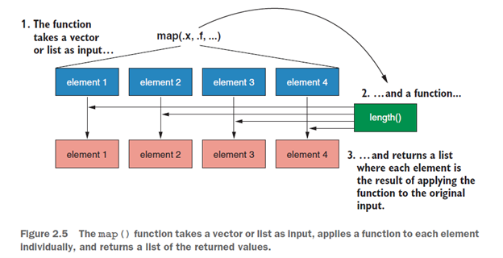
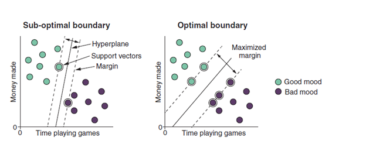
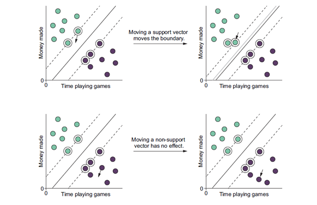
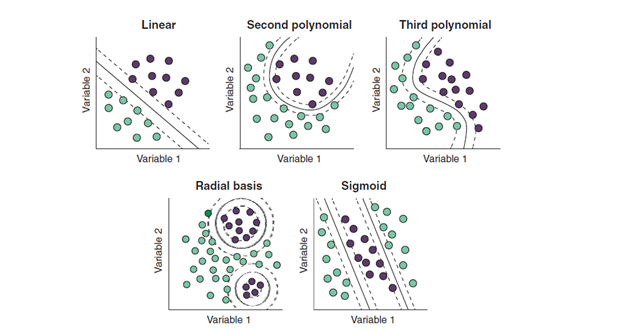
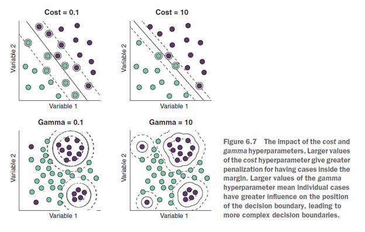
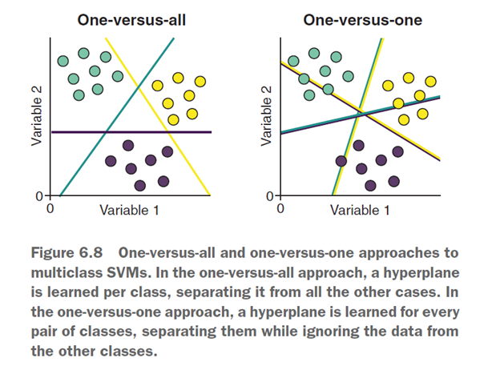
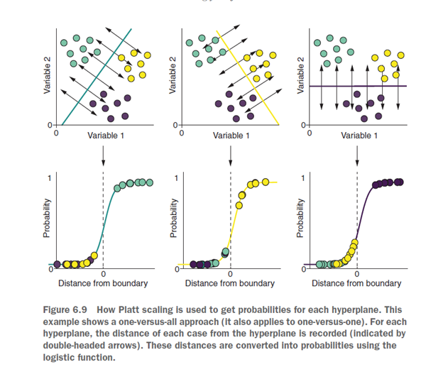
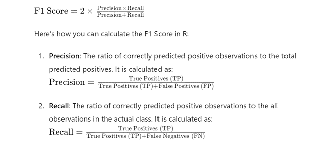

### Set up Rstudio
Setting up RMarkdown when opening it enables you to create dynamic, reproducible, and visually appealing reports, presentations, and documents, that can help you communicate your data analysis and research findings more effectively.
```{r setup, include=FALSE}
knitr::opts_chunk$set(echo = TRUE, warning=FALSE,comment = NA, message=FALSE,
                      fig.height=4, fig.width=6)
```


## AI and machine learning
Arthur Samuel, a scientist at IBM, first used the term machine learning in 1959. He used it to describe a form of AI that involved training an algorithm to learn to play the game of checkers. The word learning is what’s important here, as this is what distinguishes machine learning approaches from traditional AI. Traditional AI is programmatic. In other words, you give the computer a set of rules so that when it encounters new data, it knows precisely which output to give. An example of this would be using if else statements to classify animals as dogs, cats,
or snakes:

```{r}
numberOfLegs <- c(4, 4, 0)
climbsTrees <- c(TRUE, FALSE, TRUE)

for (i in 1:3) {
  if (numberOfLegs[i] == 4) {
if (climbsTrees[i]) print("cat") else print("dog")
    } else print("snake")
}
```

In this R code, I’ve created three rules, mapping every possible input available to us to an output:
*1 If the animal has four legs and climbs trees, it’s a cat.*
*2 If the animal has four legs and does not climb trees, it’s a dog.*
*3 Otherwise, the animal is a snake.*
Now, if we apply these rules to the data, we get the expected answers as shown above

The problem with this approach is that we need to know in advance all the possible outputs the computer should give, and the system will never give us an output that we haven’t told it to give. Contrast this with the machine learning approach, where instead of telling the computer the rules, we give it the data and allow it to learn the rules for itself. The advantage of this approach is that the machine can “learn” patterns we didn’t even know existed in the data—and the more data we provide, the better it gets at learning those patterns

### Load Tidyverse
```{r}
library(tidyverse)
```

### Creating Tipple
```{r}
myTib <- tibble(x = 1:4, 
                y = c("london", "beijing", "las vegas", "berlin")) 
myTib

```


If you’re used to working with data frames, you will immediately notice two differences in how tibbles are printed:
* When you print a tibble, it tells you that it’s a tibble and its dimensions.
* Tibbles tell you the type of each variable.


### Convert data frame to tibble
```{r}
myDf <- data.frame(x = 1:4,
                   y = c("london", "beijing", "las vegas", "berlin"))
myDf
dfToTib <- as_tibble(myDf)
dfToTib
```

### Differences between data frames and tibbles
If you’re used to working with data frames, you’ll notice a few differences with tibbles. I’ve summarized the most notable differences between data frames and tibbles in this section.

### TIBBLES DON’T CONVERT YOUR DATA TYPES
A common frustration people have when creating data frames is that they convert string variables to factors by default. This can be annoying because it may not be the best way to handle the variables. To prevent this conversion, you must supply the stringsAsFactors = FALSE argument when creating a data frame. In contrast, tibbles don’t convert string variables to factors by default. This behavior is desirable because automatic conversion of data to certain types can be a frustrating source of bugs:

```{r}
myDf <- data.frame(x = 1:4,
                   y = c("london", "beijing", "las vegas", "berlin"))

myDfNotFactor <- data.frame(x = 1:4,
                            y = c("london", "beijing", "las vegas", "berlin"),
stringsAsFactors = FALSE)

myTib <- tibble(x = 1:4,
                y = c("london", "beijing", "las vegas", "berlin"))
myTib
```

### Check!!!!
```{r}
class(myDf$y)
```

```{r}
class(myDfNotFactor$y)
```

```{r}
class(myTib$y)
```

###### Note!!!
If you want a variable to be a factor in a tibble, you simply wrap the c() function inside
factor():
```{r}
myTib <- tibble(x = 1:4,
                y = factor(c("london", "beijing", "las vegas", "berlin")))
myTib
```

When you print a data frame, all the columns are printed to the console (by default), making it difficult to view early variables and cases. When you print a tibble, it only prints the first 10 rows and the number of columns that fit on your screen (by default), making it easier to get a quick understanding of the data.

```{r}
data(starwars)
starwars
```

```{r}
as.data.frame(starwars)
```

### Variables are Created Sequentially
When building a tibble, variables are created sequentially so that later variables can reference those defined earlier. This means we can create variables on the fly that refer to other variables in the same function call:
```{r}
sequentialTib <- tibble(nItems = c(12, 45, 107),
                        cost = c(0.5, 1.2, 1.8),
totalWorth = nItems * cost)
sequentialTib
```

### Exercise 1: Load the data mtcars and explore the data using summary()
```{r}
data("mtcars")
summary(mtcars)
```

```{r}
head(mtcars,5)
```

### Summary
```{r}
library(stargazer)
stargazer(mtcars[,-1], type = "text")
```

## What the dplyr package is and what it does
When working with data, we often need to perform operations on it such as the following:
* Selecting only the rows and/or columns of interest
* Creating new variables
* Arranging the data in ascending or descending order of certain variables
* Getting summary statistics
There may also be a natural grouping structure in the data that we would like to maintain when performing these operations. The dplyr package allows us to perform these operations in a very intuitive way. Let’s work through an example.

```{r}
library(tibble)
data(CO2)
CO2
```

```{r}
CO2tib <- as_tibble(CO2)
CO2tib
```

### Selecting variables
```{r}
selectedData <- select(CO2tib, 1, 2, 3, 5)
selectedData
attach(selectedData)
```

*Exercise 2*
Select all of the columns of your mtcars tibble except the qsec and vs variables.
```{r}
data("mtcars")
head(mtcars,5)
```

```{r}
selectedData1 <- select(mtcars, -7,-8)
selectedData1
```


Now let’s suppose we wish to filter our data to include only cases whose uptake was greater than 16. We can do this using the filter() function. The first argument of filter() is, once again, the data, and the second argument is a logical expression that will be evaluated for each row. We can include multiple conditions here by separating them with commas.


```{r}
filteredData <- filter(selectedData, uptake > 16)
filteredData      
```

### Exercise 3
Filter your mtcars tibble to include only cases with a number of cylinders (cyl) not equal to 8.
```{r}
attach(mtcars)
select_cars <- filter(mtcars, cyl != 8)
select_cars
```

### Grouping data with group_by function
```{r}
groupedData <- group_by(filteredData, Plant)
groupedData
```

### Summarizing the data using summarize function
```{r}
summarizedData <- summarize(groupedData, meanUp = mean(uptake),
                            sdUp = sd(uptake))
summarizedData
```

### Creating new variables using mutate()
```{r}
mutatedData <- mutate(summarizedData, CV = (sdUp / meanUp) * 100)
mutatedData
```

The arrange() function takes the data as the first argument, followed by the variable(s) we wish to arrange the cases by. We can arrange by multiple columns by separating them with commas: doing so will arrange the cases in the order of the first
variable, and any ties will be ordered based on their value of the second variable, and so on with subsequent ties.
```{r}
arrangedData <- arrange(mutatedData, CV)
arrangedData
```

Everything we did in section 2.4.1 could be achieved using base R, but I hope you can see that the dplyr functions—or verbs, as they’re often called (because they are human-readable and clearly imply what they do)—help make the code simpler and more
human-readable. But the power of dplyr really comes from the ability to chain these functions together into intuitive, sequential processes. At each stage of our CO2 data manipulation, we saved the intermediate data and applied the next function to it. This is tedious, creates lots of unnecessary data objects in our R environment, and is not as human-readable. Instead, we can use the pipe
operator, %>%, which becomes available when we load dplyr. The pipe passes the output of the function on its left as the first argument to the function on its right. Let’s look at a basic example:

```{r}
library(dplyr)
c(1, 4, 7, 3, 5) %>% mean()
```

```{r}
arrangedData <- CO2tib %>%
  select(c(1:3, 5)) %>%
  filter(uptake > 16) %>%
  group_by(Plant) %>%
  summarize(meanUp = mean(uptake), sdUp = sd(uptake)) %>%
  mutate(CV = (sdUp / meanUp) * 100) %>%
  arrange(CV)
arrangedData
```

Read the code from top to bottom, and every time you come to a %>% operator, say “and then.” You would read it as “Take the CO2 data, and then select these columns, and then filter these rows, and then group by this variable, and then summarize with these variables, and then mutate this new variable, and then arrange in order of this variable and save the output as arrangedData. Can you see that this is how you might explain your data-manipulation process to a colleague in plain English? This is the power of dplyr: being able to perform complex data manipulations in a logical, human-readable way.

## *Exercise 4*
Group the mtcars tibble by the gear variable, summarize the medians of the mpg and disp variables, and mutate a new variable that is the mpg median divided by the disp median, all chained together with the %>% operator.

### What the ggplot2 package is and what it does
In R, there are three main plotting systems:
*1. Base graphics*
*2. Lattice*
*3. ggplot2*

Arguably, ggplot2 is the most popular system among data scientists; and as it’s part of the tidyverse, we will use this system to plot our data throughout this book. The “gg” in ggplot2 stands for grammar of graphics, a school of thought that says any data graphic
can be created by combining data with layers of plot components such as axes, tickmarks, gridlines, dots, bars, and lines. By layering plot components like this, you can use ggplot2 to create communicative, attractive plots in a very intuitive way. Let’s load the iris dataset that comes with R and create a scatter plot of two of its variables. This data was collected and published by Edgar Anderson in 1935 and contains length and width measurements of the petals and sepals of three species of iris plant.

```{r}
library(ggplot2)
data(iris)
myPlot <- ggplot(iris, aes(x = Sepal.Length, y = Sepal.Width)) +
  geom_point() +
  theme_bw()
myPlot
```

The next layer is a function called geom_point(). Geom stands for geometric object, which is a graphical element used to represent data points, such as bars, lines, box and whiskers, and so on; the functions to produce these layers are all named geom_[graphical element]. For example, let’s add two new layers to our plot: geom_density_2d(), which adds density contours; and geom_smooth(), which fits a smoothed line with confidence bands to the data (see figure 2.2).

```{r}
myPlot +
  geom_density_2d() +
  geom_smooth()
```

### Mapping species to the shape and color aesthetics
```{r}
par(mfrow = c(1,2))
ggplot(iris, aes(x = Sepal.Length, y = Sepal.Width, shape = Species)) +
  geom_point() +
  theme_bw()
ggplot(iris, aes(x = Sepal.Length, y = Sepal.Width, col = Species)) +
  geom_point() +
  theme_bw()
```

One final thing I want to teach you about ggplot() is its extremely powerful faceting functionality. Sometimes we may wish to create subplots of our data where each subplot, or facet, displays data belonging to some group present in the data. For example, figure 2.4 shows the same iris data, but this time faceted by the Species variable. The code to create this plot is shown in listing 2.13: It is simply done by adding a facet_wrap() layer to the ggplot call, and specified I want it to facet by (~ Species).

```{r}
ggplot(iris, aes(x = Sepal.Length, y = Sepal.Width)) + 
  facet_wrap(~ Species) +
  geom_point() +
theme_bw()
```

While there is much more you can do with ggplot2 than is presented here (including customizing the appearance of virtually everything), I just want to give you an understanding of how to create the basic plots needed to replicate those you’ll find throughout the book. If you want to take your data-visualization skills to the next level, I strongly recommend ggplot2: Elegant Graphics for Data Analysis by Hadley Wickham (Springer International Publishing, 2016).

## Exercise 5
*Create a scatter plot of the drat and wt variables from your mtcars tibble, and color the dots by the carb variable. See what happens when you wrap the carb aesthetic mapping in as.factor().*

### What the tidyr package is and what it does
Quite often, as data scientists, we don’t have much control over the format data is in when it comes to us; we commonly have to
restructure untidy data into a tidy format so that we can pass it into our machine learning pipelines. Let’s make an untidy tibble and convert it into its tidy format.
Listing 2.14 shows a tibble of fictitious patient data, where patients’ body mass index (BMI) was measured at month 0, month 3, and month 6 after the start of some imaginary intervention. Is this data tidy? Well, no. There are only three variables in the data:
* Patient ID
* The month the measurement was taken
* The BMI measurement
But we have four columns! Also, each row doesn’t contain the data for a single observation: it contains all the observations made on that patient.

```{r}
library(tibble)
library(tidyr)
patientData <- tibble(Patient = c("A", "B", "C"),
                      Month0 = c(21, 17, 29),
                      Month3 = c(20, 21, 27),
                      Month6 = c(21, 22, 23))
patientData
```

To convert this untidy tibble into its tidy counterpart, we can use tidyr’s gather() function. The gather() function takes the data as its first argument. The key argument defines the name of the new variable that will represent the columns we are “gathering.” In this case, the columns we are gathering are named Month0, Month3, and Month6, so we call the new column that will hold these keys Month.
```{r}
tidyPatientData <- gather(patientData, key = Month, 
                          value = BMI, -Patient)
tidyPatientData
```

We could have achieved the same result by typing the following, instead (note that the tibbles returned by the two listings are identical).

```{r}
gather(patientData, key = Month, value = BMI, Month0:Month6)
```

```{r}
gather(patientData, key = Month, value = BMI, c(Month0, Month3, Month6))
```


### Converting data to wide format
The data structure in the patientData tibble is called wide format, where observations for a single case are placed in the same row, across multiple columns. Mostly we want to work with tidy data because it makes our lives simpler: we can see immediately which variables we have, grouping structures are made clear, and most functions are designed to work easily with tidy data. There are, however, some rare occasions where we need to convert our tidy data into wide format, perhaps because a function we need expects the data in this format. We can convert tidy data into its wide format using the spread() function:

```{r}
spread(tidyPatientData, key = Month, value = BMI)
```

## Exercise 6
*Gather the vs, am, gear, and carb variables from your mtcars tibble into a single keyvalue pair.*

### What the purrr package is and what it does
The last tidyverse package I’m going to show you is purrr (with three r’s). R gives us the tools to use it as a functional programming language. This means it gives us the tools to treat all computations like mathematical functions that return their values, without altering anything in the workspace.

#### Creating a List of Numeric Vectors
```{r}
a <- 20
pure <- function() {
  a <- a + 1
a
}
side_effect <- function() {
  a <<- a + 1
a
}
```

```{r}
c(pure(), pure())
c(side_effect(), side_effect())
```

### Replacing for loops with map()
The purrr package provides a set of functions that allow us to apply a function to each element of a list. Which purrr function to use depends on the number of inputs and what we want our output to be; in this section, I’ll demonstrate the importance of the most commonly used functions from this package.

```{r}
listOfNumerics <- list(a = rnorm(5),
                       b = rnorm(9),
                       c = rnorm(10))
listOfNumerics
```

Now, let’s say we want to apply a function to each of the three list elements separately, such as the length() function to return the length of each element. We could use a for loop to do this, iterating over each list element and saving the length as an element of a new list that we predefine to save time:

```{r}
elementLengths <- vector("list", length = 3)
for(i in seq_along(listOfNumerics)) {
  elementLengths[[i]] <- length(listOfNumerics[[i]])
}
elementLengths
```

This code is difficult to read, requires us to predefine an empty vector to prevent the loop from being slow, and has a side effect: if we run the loop again, it will overwrite the elementLengths list. Instead, we can replace the for loop with the map() function. The first argument of all the functions in the map family is the data we’re iterating over. The second argument is the function we’re applying to each list element. Take a look at figure 2.5, which illustrates how the map() function applies a function to every element of a list/vector and returns a list containing the outputs. In this example, the map() function applies the length() function to each element
of the listOfNumerics list and returns these values as a list. Notice that the map() function also uses the names of the input elements as the names of the output elements (a, b, and c):

```{r}

```

```{r}
map(listOfNumerics, length)
```

### Returning an atomic vector instead of a list
So the map() function always returns a list. But what if, instead of returning a list, we wanted to return an atomic vector? The purrr package provides a number of functions to do just that:

* map_dbl() returns a vector of doubles (decimals).
* map_chr() returns a character vector.
* map_int() returns a vector of integers.
* map_lgl() returns a logical vector.

Each of these functions returns an atomic vector of the type specified by its suffix. In this way, we are forced to think about and predetermine what type of data our output should be. For example, as shown in listing 2.18, we can return the lengths of each of
our listOfNumerics list elements just as before, using the map_int() function. Just like map(), the map_int() function applies the length() function to each element of our list, but it returns the output as a vector of integers. We can do the same thing using the map_chr() function, which coerces the output into a character vector, but the map_lgl() function throws an error because it can’t coerce the output into a logical vector.

```{r}
map_int(listOfNumerics, length)
map_chr(listOfNumerics, length)
```

###### Returning a tible with map_df
```{r}
map_df(listOfNumerics, length)
```

### Using anonymous functions inside the map() family
Sometimes we want to apply a function to each element of a list that we haven’t defined yet. Functions that we define on the fly are called anonymous functions and can be useful when the function we’re applying isn’t going to be used often enough to warrant assigning it to an object. Using base R, we define an anonymous function by simply calling the function() function.

###### Defining an anonymous function with function()
```{r}
map(listOfNumerics, function(.) . + 2)
```

### NOTE 
Notice the . in the anonymous function. This represents the element that map() is currently iterating over. The expression after function(.) is the body of the function. There is nothing wrong with this syntax—it works perfectly fine—but purrr provides a shorthand for function(.): the ~ (tilde) symbol. by substituting ~ for function(.).
```{r}
map(listOfNumerics, ~. + 2)
```

### Using walk() to produce a function’s side effects
Sometimes we want to iterate over a function for its side effects. Probably the most common example is when we want to produce a series of plots. In this situation, we can use the walk() function to apply a function to each element of a list to produce the function’s side effects. The walk() function also returns the original input data we pass it, so it’s useful for plotting an intermediate step in a series of piped operations. Here’s an example of walk() being used to create a separate histogram for each element of our list:

```{r}
par(mfrow = c(1, 3))
walk(listOfNumerics, hist)
```

### NOTE 
The par(mfrow = c(1, 3)) function call simply splits the plotting device into two rows and four columns for base plots.
But what if we want to use the name of each list element as the title for its histogram? We can do this using the iwalk() function, which makes the name or index of each element available to us. In the function we supply to iwalk(), we can use .x to reference the list element we’re iterating over and .y to reference its name/index:

```{r}
par(mfrow = c(1, 3))
iwalk(listOfNumerics, ~hist(.x, main = .y))
```

### Iterating over multiple lists simultaneously
Sometimes the data we wish to iterate over isn’t contained in a single list. Imagine that we want to multiply each element in our list by a different value. We can store these values in a separate list and use the map2() function to iterate over both lists simultaneously, multiplying the element in the first list by the element in the second. This time, instead of referencing our data with ., we specifically reference the first and second lists using .x and .y, respectively:

```{r}
multipliers <- list(0.5, 10, 3)
map2(.x = listOfNumerics, .y = multipliers, ~.x * .y)
```

Now, imagine that instead of iterating over just two lists, we want to iterate over three or more. The pmap() function allows us to iterate over multiple lists simultaneously. I use pmap() when I want to test multiple combinations of arguments for a function.
The rnorm() function draws a random sample from the normal distribution and has three arguments: n (the number of samples), mean (the center of the distribution), and sd (the standard deviation). We can create a list of values for each and then use pmap() to iterate over each list to run the function on each combination.

We start by using the expand.grid() function to create a data frame containing every combination of the input vectors. Because data frames are really just lists of columns, supplying one to pmap() will iterate a function over each column in the data frame. Essentially, the function we ask pmap() to iterate over will be run using the arguments contained in each row of the data frame. Therefore, pmap() will return eight different random samples, one corresponding to each combination of arguments in the data frame. Because the first argument of all map family functions is the data we wish to iterate over, we can chain them together using the %>% operator. The following code pipes the random samples returned by pmap() into the iwalk() function to draw a separate histogram for each sample, labeled with its index.

```{r}
arguments <- expand.grid(n = c(100, 200),
                         mean = c(1, 10),
                         sd = c(1, 10))
arguments
```

```{r}
par(mfrow = c(2, 4))
pmap(arguments, rnorm) %>%
  iwalk(~hist(.x, main = paste("Element", .y)))
```

Don’t worry if you haven’t memorized all of the tidyverse functions I just covered— we’ll be using these tools throughout the book in our machine learning pipelines. There’s also much more we can do with tidyverse tools than I’ve covered here, but this will certainly be enough for you to solve the most common data-manipulation problems you’ll encounter. Now that you’re armed with the knowledge of how to use this book, in the next chapter we’ll dive into the theory of machine learning.


# PART 2
## CLASSIFICATION
### Classification Based on Similarities with k-Nearest Neighbors (k-NN)
Now that we’ve covered some basic machine learning terminology, and your tidyverse skills are developing, let’s finally start learning some practical machine learning skills. The rest of the book is split into four parts:
*Classification*
*Regression*
*Dimension reduction*
*Clustering*

This is probably the most important chapter of the entire book. In it, I’m going to show you how the k-nearest neighbors (kNN) algorithm works, and we’re going to use it to classify potential diabetes patients. In addition, I’m going to use the kNN algorithm to teach you some essential concepts in machine learning that we will rely on for the rest of the book. By the end of this chapter, not only will you understand and be able to use the kNN algorithm to make classification models, but you will be able to validate its performance and tune it to improve its performance as much as possible. Once the model is built, you’ll learn how to pass new, unseen data into it and get the data’s predicted classes (the value of the categorical or grouping variable we are trying to predict)

### The k-Nearest Neighbours
Imagine that you work for a reptile conservation project aiming to count the numbers of grass snakes, adders, and slow worms in a woodland. Your job is to build a model that allows you to quickly classify reptiles you find into one of these three classes. When you find one of these animals, you only have enough time to rapidly estimate its length and some measure of how aggressive it is toward you, before it slithers away (funding is very scarce for your project). A reptile expert helps you manually classify the observations you’ve made so far, but you decide to build a kNN classifier to help you quickly classify future specimens you come across.

We can describe the kNN algorithm (and other machine learning algorithms) in terms of two phases:
*1 The training phase*
*2 The prediction phase*

### Building your First k-NN Model
Imagine that you work in a hospital and are trying to improve the diagnosis of patients with diabetes. You collect diagnostic data over a few months from suspected diabetes patients and record whether they were diagnosed as healthy, chemically diabetic, or overtly diabetic. You would like to use the kNN algorithm to train a model that can predict which of these classes a new patient will belong to, so that diagnoses can be improved. This is a three-class classification problem.

### Load the following important libraries
```{r}
library(mlr)
library(tidyverse)
```

### Loading and exploring the diabetes dataset
Now, let’s load some data built into the mclust package, convert it into a tibble, and explore it a little (recall from chapter 2 that a tibble is the tidyverse way of storing rectangular data): see listing 3.1. We have a tibble with 145 cases and 4 variables. The class factor shows that 76 of the cases were non-diabetic (Normal), 36 were chemically diabetic (Chemical), and 33 were overtly diabetic (Overt). The other three variables are continuous measures of the level of blood glucose and insulin after a glucose
tolerance test (glucose and insulin, respectively), and the steady-state level of blood glucose (sspg).
```{r}
data(diabetes, package = "mclust")
diabetesTib <- as_tibble(diabetes)
head(diabetesTib)
summary(diabetesTib)
```

### View the first few observations
```{r}
head(diabetesTib,5)
```

To show how these variables are related, they are plotted against each other in figure 3.5. The code to generate these plots is in listing 3.2.
```{r}
ggplot(diabetesTib, aes(glucose, insulin, col = class)) +
  geom_point() +
  theme_bw()

ggplot(diabetesTib, aes(sspg, insulin, col = class)) +
  geom_point() +
  theme_bw()

ggplot(diabetesTib, aes(sspg, glucose, col = class)) +
  geom_point() +
  theme_bw()
```

Looking at the data, we can see there are differences in the continuous variables among the three classes, so let’s build a kNN classifier that we can use to predict diabetes status from measurements of future patients.

Our dataset only consists of continuous predictor variables, but often we may be working with categorical predictor variables too. The kNN algorithm can’t handle categorical variables natively; they need to first be encoded somehow, or distance metrics other than Euclidean distance must be used. It’s also very important for kNN (and many machine learning algorithms) to scale the predictor variables by dividing them by their standard deviation. This preserves the relationships between the variables, but ensures that variables measured on larger scales aren’t given more importance by the algorithm. In the current example, if we divided the glucose and insulin variables by 1,000,000, then predictions would rely mostly on the value of the sspg variable. We don’t need to scale the predictors ourselves because, by default, the kNN algorithm wrapped by the mlr package does this for us.

We understand the problem we’re trying to solve (classifying new patients into one of three classes), and now we need to train the kNN algorithm to build a model that will solve that problem. Building a machine learning model with the mlr package has three main stages:

*1 Define the task.* The task consists of the data and what we want to do with it. In this case, the data is diabetesTib, and we want to classify the data with the class variable as the target variable.

*2 Define the learner.* The learner is simply the name of the algorithm we plan to use, along with any additional arguments the algorithm accepts.

*3 Train the model.* This stage is what it sounds like: you pass the task to the learner, and the learner generates a model that you can use to make future predictions.

##### TIP 
This may seem unnecessarily cumbersome, but splitting the task, learner, and model into different stages is very useful. It means we can define a single task and apply multiple learners to it, or define a single learner and test it with multiple different tasks.

### Telling mlr what we’re trying to achieve: Defining the task
Let’s begin by defining our task. The components needed to define a task are

1. The data containing the predictor variables (variables we hope contain the information needed to make predictions/solve our problem)
2. The target variable we want to predict

For supervised learning, the target variable will be categorical if we have a classification problem, and continuous if we have a regression problem. For unsupervised learning, we omit the target variable from our task definition, as we don’t have access to labeled data.

We want to build a classification model, so we use the makeClassifTask() function to define a classification task. When we build regression and clustering models in parts 3 and 5 of the book, we’ll use makeRegrTask() and makeClusterTask(), respectively. We supply the name of our tibble as the data argument and the name of the factor that contains the class labels as the target argument:

#### NOTE 
You may notice a warning message from mlr when you build the task, stating that your data is not a pure data.frame (it’s a tibble). This isn’t a problem, because the function will convert the tibble into a data.frame for you.
```{r}
diabetesTask <- makeClassifTask(data = diabetesTib, target = "class")
diabetesTask
```

Next, let’s define our learner. The components needed to define a learner are as follows:
* The class of algorithm we are using:
 "classif." for classification
 "regr." for regression
 "cluster." for clustering
 "surv." and "multilabel." for predicting survival and multilabel classification, which I won’t discuss

* The algorithm we are using
* Any additional options we may wish to use to control the algorithm

As you’ll see, the first and second components are combined together in a single character argument to define which algorithm will be used (for example, "classif.knn").

We use the makeLearner() function to define a learner. The first argument to the makeLearner() function is the algorithm that we’re going to use to train our model. In this case, we want to use the kNN algorithm, so we supply "classif.knn" as the argument. See how this is the class ("classif.) joined to the name (knn") of the algorithm?
The argument par.vals stands for parameter values, which allows us to specify the number of k-nearest neighbors we want the algorithm to use. For now, we’ll just set this to 2, but we’ll discuss how to choose k soon:

```{r}
knn <- makeLearner("classif.knn", par.vals = list("k" = 2))
```

### Putting it all together: Training the model
Now that we’ve defined our task and our learner, we can now train our model. The components needed to train a model are the learner and task we defined earlier.

This is achieved with the train() function, which takes the learner as the first argument and the task as its second argument:

```{r}
knnModel <- train(knn, diabetesTask)
knnModel$task.desc
```

We have our model, so let’s pass the data through it to see how it performs. The predict() function takes unlabeled data and passes it through the model to get the predicted classes. The first argument is the model, and the data being passed to it is given as the newdata argument:

```{r}
knnPred <- predict(knnModel, newdata = diabetesTib)
knnPred
```

We can pass these predictions as the first argument of the performance() function. This function compares the classes predicted by the model to the true classes, and returns performance metrics of how well the predicted and true values match each other.

We specify which performance metrics we want the function to return by supplying them as a list to the measures argument. The two measures I’ve asked for are mmce, the mean misclassification error; and acc, or accuracy. MMCE is simply the proportion of cases classified as a class other than their true class. Accuracy is the opposite of this: the proportion of cases that were correctly classified by the model. You can see that the two sum to 1.00:

```{r}
performance(knnPred, measures = list(mmce, acc))
```

So our model is correctly classifying 94.48% of cases! Does this mean it will perform well on new, unseen patients? The truth is that we don’t know. Evaluating model performance by asking it to make predictions on data you used to train it in the first place tells you very little about how the model will perform when making predictions on completely unseen data. Therefore, you should never evaluate model performance
this way. Before we discuss why, I want to introduce an important concept called the bias-variance trade-off.

## Balancing two sources of model error:
### The bias-variance trade-off
This is a problem resulting from over-fitting or under-fitting our model. Underfitting and overfitting both introduce error and reduce the generalizability of the model: the ability of the model to generalize to future, unseen data. They are also opposed to each other: somewhere between a model that underfits and has bias, and a model that overfits and has variance, is an optimal model that balances the biasvariance
trade-off. 

### Using cross-validation to tell if we’re overfitting or underfitting
This process is called cross-validation (CV), and it is an extremely important approach in any supervised machine learning pipeline. Once we have cross-validated our model and are happy with its performance, we then use all the data we have (including the data in the test set) to train the final model (because typically, the more data we train our model with, the less bias it will have).

##### There are three common cross-validation approaches:
* Holdout cross-validation
* K-fold cross-validation
* Leave-one-out cross-validation

### Cross-validating our kNN model
Let’s start by reminding ourselves of the task and learner we created earlier:

```{r}
diabetesTask <- makeClassifTask(data = diabetesTib, target = "class")
knn <- makeLearner("classif.knn", par.vals = list("k" = 2))
```


Before we train the final model on all the data, let’s cross-validate the learner. Ordinarily, you would decide on a CV strategy most appropriate for your data; but for the purposes of demonstration, I’m going to show you holdout, k-fold, and leave-oneout CV.

### Holdout cross-validation
When following this approach, you need to decide what proportion of the data to use as the test set. The larger the test set is, the smaller your training set will be. Here’s the confusing part: performance estimation by CV is also subject to error and the biasvariance trade-off. If your test set is too small, then the estimate of performance is going to have high variance; but if the training set is too small, then the estimate of performance is going to have high bias. A commonly used split is to use two-thirds of the data for training and the remaining one-third as a test set, but this depends on the number of cases in the data, among other things.

###### MAKING A HOLDOUT RESAMPLING DESCRIPTION
The first step when employing any CV in mlr is to make a resampling description, which is simply a set of instructions for how the data will be split into test and training sets. The first argument to the makeResampleDesc() function is the CV method we’re going to use: in this case, "Holdout". For holdout CV, we need to tell the function what proportion of the data will be used as the training set, so we supply this to the split argument:

```{r}
holdout <- makeResampleDesc(method = "Holdout", split = 2/3,
                            stratify = TRUE)
```

#### PERFORMING HOLDOUT CV
Now that we’ve defined how we’re going to cross-validate our learner, we can run the CV using the resample() function. We supply the learner and task that we created, and the resampling method we defined a moment ago, to the resample() function. We also ask it to give us measures of MMCE and accuracy:

```{r}
holdoutCV <- resample(learner = knn, task = diabetesTask,
                      resampling = holdout, measures = list(mmce, acc))
```

###### Extract the aggr component 
```{r}
holdoutCV$aggr
```

##### You’ll notice two things:
*The accuracy of the model as estimated by holdout cross-validation is less than when we evaluated its performance on the data we used to train the full model. This exemplifies my point earlier that models will perform better on the data that trained them than on unseen data.*

*Your performance metrics will probably be different than mine. In fact, run the resample() function over and over again, and you’ll get a very different result each time! The reason for this variance is that the data is randomly split into the test and training sets. Sometimes the split is such that the model performs well on the test set; sometimes the split is such that it performs poorly.*

#### Calculate the Confusion Matrix
To get a better idea of which groups are being correctly classified and which are being misclassified, we can construct a confusion matrix. A confusion matrix is simply a tabular representation of the true and predicted class of each case in the test set.
```{r}
calculateConfusionMatrix(holdoutCV$pred, relative = TRUE)
```

The absolute confusion matrix is easier to interpret. The rows show the true class labels, and the columns show the predicted labels. The numbers represent the number of cases in every combination of true class and predicted class. For example, in this matrix, 8 patients were correctly classified as chemically diabetic, but four were erroneously classified as healthy. Correctly classified patients are found on the diagonal of the matrix (where true class == predicted class).

From the relative confusion matrix for example, in this matrix, 67% of chemically diabetic patients were
correctly classified, while 33% were misclassified as healthy. 

Confusion matrices help us understand which classes our model classifies well and which ones it does worse at classifying. For example, based on this confusion matrix, it looks like our model struggles to distinguish healthy patients from chemically diabetic ones.

### K-fold cross-validation
In k-fold CV, we randomly split the data into approximately equal-sized chunks called folds. Then we reserve one of the folds as a test set and use the remaining data as the training set (just like in holdout). We pass the test set through the model and make a record of the relevant performance metrics. Now, we use a different fold of the data as our test set and do the same thing. We continue until all the folds have been used once as the test set. We then get an average of the performance metric as an estimate
of model performance.

This approach will typically give a more accurate estimate of model performance because every case appears in the test set once, and we are averaging the estimates over many runs. But we can improve this a little by using repeated k-fold CV, where, after the previous procedure, we shuffle the data around and perform it again.

#### PERFORMING K-FOLD CV
We perform k-fold CV in the same way as holdout. This time, when we make our resampling description, we tell it we’re going to use repeated k-fold cross-validation ("RepCV"), and we tell it how many folds we want to split the data into. The default number of folds is 10, which is often a good choice, but I want to show you how you can explicitly control the splits. Next, we tell the function that we want to repeat the 10-fold CV 50 times with the reps argument. This gives us 500 performance measures to average across! Again, we ask for the classes to be stratified among the folds:

```{r}
kFold <- makeResampleDesc(method = "RepCV", folds = 10, reps = 50,
                          stratify = TRUE)
kFoldCV <- resample(learner = knn, task = diabetesTask,
                    resampling = kFold, measures = list(mmce, acc))
```

#### Extract the aggr components
```{r}
kFoldCV$aggr
```

The model correctly classified 89.8% of cases on average—much lower than when we predicted the data we used to train the model! Rerun the resample() function a few times, and compare the average accuracy after each run. The estimate is much more stable than when we repeated holdout CV.

We’re usually only interested in the average performance measures, but you can access the performance measure from every iteration by running

```{r}
kFoldCV$measures.test
```

### CHOOSING THE NUMBER OF REPEATS
Your goal when cross-validating a model is to get as accurate and stable an estimate of model performance as possible. Broadly speaking, the more repeats you can do, the more accurate and stable these estimates will become. At some point, though, having more repeats won’t improve the accuracy or stability of the performance estimate. So how do you decide how many repeats to perform? A sound approach is to choose a number of repeats that is computationally reasonable, run the process a few times, and see if the average performance estimate varies a lot. If not, great. If it does vary a lot, you should increase the number of repeats.

### Confusion Matrix
Now, let’s build the confusion matrix based on the repeated k-fold CV:

```{r}
calculateConfusionMatrix(kFoldCV$pred, relative = TRUE)
```

## Leave-one-out cross-validation
Leave-one-out CV can be thought of as the extreme of k-fold CV: instead of breaking the data into folds, we reserve a single observation as a test case, train the model on the whole of the rest of the data, and then pass the test case through it and record the relevant performance metrics. Next, we do the same thing but select a different observation as the test case. We continue doing this until every observation has been used once as the test case, where we take the average of the performance metrics.

Leave-one-out CV is useful for small datasets where splitting it into k folds would give variable results. It is also computationally less expensive than repeated, k-fold CV.

#### NOTE 
A supervised learning model that has not been cross-validated is virtually useless, because you have no idea whether the predictions it makes on new data will be accurate or not.

### PERFORMING LEAVE-ONE-OUT CV
Creating a resampling description for leave-one-out is just as simple as for holdout and k-fold CV. We specify leave-one-out CV when making the resample description by supplying LOO as the argument to the method. Because the test set is only a single case, we obviously can’t stratify with leave-one-out. Also, because each case is used once as the test set, with all the other data used as the training set, there’s no need to repeat the procedure:

```{r}
LOO <- makeResampleDesc(method = "LOO")
```


Now, let’s run the CV and get the average performance measures:

```{r}
LOOCV <- resample(learner = knn, task = diabetesTask, resampling = LOO,
                  measures = list(mmce, acc))
```

```{r}
LOOCV$aggr
```

If you rerun the CV over and over again, you’ll find that for this model and data, the performance estimate is more variable than for k-fold but less variable than for the holdout we ran earlier.

#### CALCULATING A CONFUSION MATRIX
Once again, let’s look at the confusion matrix:

```{r}
calculateConfusionMatrix(LOOCV$pred, relative = TRUE)
```

So you now know how to apply three commonly used types of cross-validation! If we’ve cross-validated our model and are happy that it will perform well enough on unseen data, then we would train the model on all of the data available to us, and use this to make future predictions. But I think we can still improve our kNN model. Remember how earlier, we manually choose a value of 2 for k? Well, randomly picking a value of k isn’t very clever, and there are much better ways we can find the optimal value.

How does changing the value of k impact model performance? Well, values of k that are too low may start to model noise in the data. For example, if we set k = 1, then a healthy patient could be misclassified as chemically diabetic just because a single chemically diabetic patient with an unusually low insulin level was their nearest neighbor. In this situation, instead of just modeling the systematic differences between the classes, we’re also modeling the noise and unpredictable variability in the data.
On the other hand, if we set k too high, a large number of dissimilar patients will be included in the vote, and the model will be insensitive to local differences in the data. This is, of course, the bias-variance trade-off we talked about earlier.

### Tuning k to improve the model
Let’s apply hyperparameter tuning to optimize the value of k for our model. An approach we could follow would be to build models with different values of k using our full dataset, pass the data back through the model, and see which value of k gives us the best performance. This is bad practice, because there’s a large chance we’ll get a value of k that overfits the dataset we tuned it on. So once again, we rely on CV to help us guard against overfitting. The first thing we need to do is define a range of values over which mlr will try, when tuning k:

```{r}
knnParamSpace <- makeParamSet(makeDiscreteParam("k", values = 1:10))
```

Next, we define how we want mlr to search the parameter space. There are a few options for this, and in later chapters we’ll explore others, but for now we’re going to use the grid search method. This is probably the simplest method: it tries every single value in the parameter space when looking for the best-performing value. For tuning continuous hyperparameters, or when we are tuning several hyperparameters at once, grid search becomes prohibitively expensive, so other methods like random search are preferred:

```{r}
gridSearch <- makeTuneControlGrid()
```

Next, we define how we’re going to cross-validate the tuning procedure, and we’re going to use my favorite: repeated k-fold CV. The principle here is that for every value in the parameter space (integers 1 to 10), we perform repeated k-fold CV. For each value of k, we take the average performance measure across all those iterations and compare it with the average performance measures for all the other values of k we tried. This will hopefully give us the value of k that performs best:

````{r}
cvForTuning <- makeResampleDesc("RepCV", folds = 10, reps = 20)
````

Now, we call the tuneParams() function to perform the tuning:

````{r}
tunedK <- tuneParams("classif.knn", task = diabetesTask,
                     resampling = cvForTuning,
                     par.set = knnParamSpace, control = gridSearch)
````

The first and second arguments are the names of the algorithm and task we’re applying, respectively. We give our CV strategy as the resampling argument, the hyperparameter space we define as the par.set argument, and the search procedure to the control argument. If we call our tunedK object, we get the best-performing value of k, 7, and the average MMCE value for that value. We can access the best-performing value of k directlyby selecting the $x component

```{r}
tunedK
```

```{r}
tunedK$x
```

We can also visualize the tuning process
```{r}
knnTuningData <- generateHyperParsEffectData(tunedK)
plotHyperParsEffect(knnTuningData, x = "k", y = "mmce.test.mean",
                    plot.type = "line") +
theme_bw()
```

Now we can train our final model, using our tuned value of k:
```{r}
tunedKnn <- setHyperPars(makeLearner("classif.knn"),
                         par.vals = tunedK$x)
tunedKnnModel <- train(tunedKnn, diabetesTask)
tunedKnnModel
```

This is as simple as wrapping the makeLearner() function, where we make a new kNN learner, inside the setHyperPars() function, and providing the tuned value of k as the par.vals argument. We then train our final model as before, using the train() function.

## Including hyperparameter tuning in cross-validation
It validates our entire model-building procedure, including the hyperparameter-tuning step. The cross-validated performance estimate
we get from this procedure should be a good representation of how we expect our model to perform on completely new, unseen data.
The process looks pretty complicated, but it is extremely easy to perform with mlr. First, we define how we’re going to perform the inner and outer CV:

```{r}
inner <- makeResampleDesc("CV")
outer <- makeResampleDesc("RepCV", folds = 10, reps = 5)
```

I’ve chosen to perform ordinary k-fold cross-validation for the inner loop (10 is the default number of folds) and 10-fold CV, repeated 5 times, for the outer loop. Next, we make what’s called a wrapper, which is basically a learner tied to some preprocessing
step. In our case, this is hyperparameter tuning, so we create a tuning wrapper with makeTuneWrapper():

```{r}
knnWrapper <- makeTuneWrapper("classif.knn", resampling = inner, 
                              par.set = knnParamSpace,
                              control = gridSearch)
```


Here, we supply the algorithm as the first argument and pass our inner CV procedure as the resampling argument. We supply our hyperparameter search space as the par.set argument and our gridSearch method as the control argument (remember that we created these two objects earlier). This “wraps” together the learning algorithm with the hyperparameter tuning procedure that will be applied inside the inner CV loop. Now that we’ve defined our inner and outer CV strategies and our tuning wrapper, we run the nested CV procedure:

```{r}
cvWithTuning <- resample(knnWrapper, diabetesTask, resampling = outer)
```

The first argument is the wrapper we created a moment ago, the second argument is the name of the task, and we supply our outer CV strategy as the resampling argument. Now sit back and relax—this could take a while! Once it finishes, you can print the average MMCE:

### Misclassification Error
```{r}
cvWithTuning$aggr
```

### Classification Accuracy
```{r}
1-cvWithTuning$aggr
```

Your MMCE value will probably be a little different than mine due to the random nature of the validation procedure, but the model is estimated to correctly classify 91.447% of cases on unseen data. That’s not bad; and now that we’ve cross-validated our model properly, we can be confident we’re not overfitting our data.

### Using our model to make predictions
We have our model, and we’re free to use it to classify new patients! Let’s imagine that some new patients come to the clinic:
```{r}
newDiabetesPatients <- tibble(glucose = c(82, 108, 300),
                              insulin = c(361, 288, 1052),
                              sspg = c(200, 186, 135))
newDiabetesPatients
```

We can pass these patients into our model and get their predicted diabetes status:

```{r}
newPatientsPred <- predict(tunedKnnModel, 
                           newdata = newDiabetesPatients)
getPredictionResponse(newPatientsPred)
```

Congratulations! Not only have you built your first machine learning model, but we’ve covered some reasonably complex theory, too. In the next chapter, we’re going to learn about logistic regression, but first I want to list the strengths and weaknesses of the k-nearest neighbor algorithm.

## Strengths and weaknesses of kNN
While it often isn’t easy to tell which algorithms will perform well for a given task, here are some strengths and weaknesses that will help you decide whether kNN will perform well for your task.

### The strengths of the kNN algorithm are as follows:
* The algorithm is very simple to understand.
* There is no computational cost during the learning process; all the computation is done during prediction.
* It makes no assumptions about the data, such as how it’s distributed.

### The weaknesses of the kNN algorithm are these:
* It cannot natively handle categorical variables (they must be recoded first, or a different distance metric must be used).
* When the training set is large, it can be computationally expensive to compute the distance between new data and all the cases in the training set.
* The model can’t be interpreted in terms of real-world relationships in the data.
* Prediction accuracy can be strongly impacted by noisy data and outliers.
* In high-dimensional datasets, kNN tends to perform poorly. This is due to a phenomenon you’ll learn about in chapter 5, called the curse of dimensionality. 

In brief, in high dimensions the distances between the cases start to look the same, so finding the nearest neighbors becomes difficult.

## Summary
kNN is a simple supervised learning algorithm that classifies new data based on the class membership of its nearest k cases in the training set. To create a machine learning model in mlr, we create a task and a learner, and then train the model using them. MMCE is the mean misclassification error, which is the proportion of misclassified cases in a classification problem. It is the opposite of accuracy. The bias-variance trade-off is the balance between two types of error in predictive accuracy. Models with high bias are underfit, and models with high variance are overfit. Model performance should never be evaluated on the data used to train it; cross-validation should be used, instead. Cross-validation is a set of techniques for evaluating model performance by splitting the data into training and test sets. Three common types of cross-validation are holdout, where a single split is used; k-fold, where the data is split into k chunks and the validation performed on each chunk; and leave-one-out, where the test set is a single case. Hyperparameters are options that control how machine learning algorithms learn, which cannot be learned by the algorithm itself. Hyperparameter tuning
is the best way to find optimal hyperparameters. If we perform a data-dependent preprocessing step, such as hyperparameter
tuning, it’s important to incorporate this in our cross-validation strategy, using nested cross-validation.

## Classifying based on odds with logistic regression
### Building your first logistic regression model
Imagine that you’re a historian interested in the RMS Titanic, which famously sank in 1912 after colliding with an iceberg. You want to know whether socioeconomic factors influenced a person’s probability of surviving the disaster. Luckily, such socioeconomic data is publicly available! Your aim is to build a binomial logistic regression model to predict whether a passenger would survive the Titanic disaster, based on data such as their gender and how much they paid for their ticket. You’re also going to interpret the model to decide which variables were important in influencing the probability of a passenger surviving. Let’s start by loading the mlr and tidyverse packages:

```{r}
library(mlr)
library(tidyverse)
library(titanic)
```

### Loading and exploring the Titanic dataset
Now let’s load the data, which is built into the titanic package, convert it into a tibble (with as_tibble()), and explore it a little. We have a tibble containing 891 cases and 12 variables of passengers of the Titanic. Our goal is to train a model that can use the information in these variables to predict whether a passenger would survive the disaster.

### Load the data
```{r}
data(titanic_train, package = "titanic")
titanicTib <- as_tibble(titanic_train)
head(titanicTib,10)
```

###### The tibble contains the following variables:
*PassengerId*—An arbitrary number unique to each passenger
*Survived*—An integer denoting survival (1 = survived, 0 = died)
*Pclass*—Whether the passenger was housed in first, second, or third class
*Name*—A character vector of the passengers’ names
*Sex*—A character vector containing “male” and “female”
*Age*—The age of the passenger
*SibSp*—The combined number of siblings and spouses on board
*Parch*—The combined number of parents and children on board
*Ticket*—A character vector with each passenger’s ticket number
*Fare*—The amount of money each passenger paid for their ticket
*Cabin*—A character vector of each passenger’s cabin number
*Embarked*—A character vector of which port passengers embarked from

### Making the most of the data: Feature engineering and feature selection
Rarely will you be working with a dataset that is ready for modeling straight away. Typically, we need to perform some cleaning first to ensure that we get the most from the data. This includes steps such as converting data to the correct types, correcting mistakes, and removing irrelevant data. The titanicTib tibble is no exception; we need to clean it up before we can pass it to the logistic regression algorithm. We’ll perform three tasks:
*1 Convert the Survived, Sex, and Pclass variables into factors.*
*2 Create a new variable called FamSize by adding SibSp and Parch together.*
*3 Select the variables we believe to be of predictive value for our model.*

```{r}
fctrs <- c("Survived", "Sex", "Pclass")

titanicClean <- titanicTib %>%
  mutate_at(.vars = fctrs, .funs = factor) %>%
  mutate(FamSize = SibSp + Parch) %>%
  select(Survived, Pclass, Sex, Age, Fare, FamSize)
head(titanicClean, 10)
```

### Plotting the data
Now that we’ve cleaned our data a little, let’s plot it to get better insight into the relationships in the data. Here’s a little trick to simplify plotting multiple variables together using ggplot2. Let’s convert the data into an untidy format, such that each of the predictor variable names is held in one column, and its values are held in another column, using the gather() function (refresh your memory of this by looking at the end of chapter 2).

###### NOTE 
The gather() function will warn that “attributes are not identical across measure variables; they will be dropped.” This is simply warning you that the variables you are gathering together don’t have the same factor levels. Ordinarily this might mean you’ve collapsed variables you didn’t mean to, but in this case we can safely ignore the warning.

### Creating an untidy tibble for plotting
```{r}
titanicUntidy <- gather(titanicClean, key = "Variable", value = "Value",
                        -Survived)
titanicUntidy
```

We now have an untidy tibble with three columns: one containing the Survived factor, one containing the names of the predictor variables, and one containing their values.

###### NOTE 
Note that the value column is a character vector (<chr>). This is because it contains “male” and “female” from the Sex variable. As a column can only hold data of a single type, all the numerical data is also converted into characters. You may be wondering why we’re doing this. Well, it allows us to use ggplot2’s faceting system to plot our different variables together. In listing 4.4, I take the titanicUntidy tibble, filter for the rows that do not contain the Pclass or Sex variables (as these are factors, we’ll plot them separately), and pipe this data into a ggplot() call.

In the ggplot() function call, we supply Survived as the x aesthetic and Value as the y aesthetic (coercing it into a numeric vector with as.numeric() because it was converted into a character by our gather() function call earlier). Next—and here’s the cool bit—we ask ggplot2 to facet by the Variable column, using the facet_wrap() function, and allow the y-axis to vary between the facets. Faceting allows us to draw subplots of our data, indexed by some faceting variable. Finally, we add a violin geometric object, which is similar to a box plot but also shows the density of data along the y-axis.

```{r}
titanicUntidy %>%
  filter(Variable != "Pclass" & Variable != "Sex") %>%
  ggplot(aes(Survived, as.numeric(Value))) +
  facet_wrap(~ Variable, scales = "free_y") +
  geom_violin(draw_quantiles = c(0.25, 0.5, 0.75)) +
theme_bw()
```

Can you see how the faceting worked? Rows in the data with different values of Variable are plotted on different subplots! This is why we needed to gather the data into an untidy format: so we could supply a single variable for ggplot2 to facet by.


Now let’s do the same thing for the factors in our dataset by filtering the data for rows that contain only the Pclass and Sex variables. This time, we want to see what proportion of passengers in each level of the factors survived. To do so, we plot the factor levels on the x-axis by supplying Value as the x aesthetic mapping; and we want to use different colors to denote survival versus non-survival, so we supply Survived as the fill aesthetic. We facet by Variable as before and add a bar geometric object with the argument position = "fill", which stacks the data for survivors and non-survivors such that they sum to 1 to show us the proportion of each. The resulting plot is shown in figure below.

```{r}
titanicUntidy %>%
  filter(Variable == "Pclass" | Variable == "Sex") %>%
  ggplot(aes(Value, fill = Survived)) +
  facet_wrap(~ Variable, scales = "free_x") +
  geom_bar(position = "fill") +
theme_bw()
```

```{r}
titanicUntidy %>%
  filter(Variable == "Pclass" | Variable == "Sex") %>%
  ggplot(aes(Value, fill = Survived)) +
  facet_wrap(~ Variable, scales = "free_x") +
  geom_bar(position = "stack") +
theme_bw()
```


```{r}
titanicUntidy %>%
  filter(Variable == "Pclass" | Variable == "Sex") %>%
  ggplot(aes(Value, fill = Survived)) +
  facet_wrap(~ Variable, scales = "free_x") +
  geom_bar(position = "dodge") +
theme_bw()
```

So it seems like passengers who survived tended to have slightly more family members on board (perhaps contradicting our hypothesis), although passengers with very large families on board tended not to survive. Age doesn’t seem to have had an obvious impact on survival, but being female meant you would be much more likely to survive. Paying more for your fare increased your probability of survival, as did being in a higher class (though the two probably correlate).

### Training the model
Now that we have our cleaned data, let’s create a task, learner, and model with mlr (specifying "classif.logreg" to use logistic regression as our learner). By setting the argument predict.type = "prob", the trained model will output the estimated probabilities of each class when making predictions on new data, rather than just the predicted class membership.

```{r}
titanicTask <- makeClassifTask(data = titanicClean, target = "Survived")
logReg <- makeLearner("classif.logreg", predict.type = "prob")
#logRegModel <- train(logReg, titanicTask)
```

Whoops! Something went wrong. What does the error message say? Hmm, it seems we have some missing data from the Age variable, and the logistic regression algorithm doesn’t know how to handle that. Let’s have a look at this variable. (I’m only displaying
the first 60 elements to save room, but you can print the entire vector.)

````{r}
titanicClean$Age[1:60]
````

### Check the total number of missing observations
```{r}
sum(is.na(titanicClean$Age))
```

Ah, we have lots of NAs (177 in fact!), which is R’s way of labeling missing data.

### Dealing with missing data
There are two ways to handle missing data:
* Simply exclude cases with missing data from the analysis
* Apply an imputation mechanism to fill in the gaps

The first option may be valid when the ratio of cases with missing values to complete cases is very small. In that case, omitting cases with missing data is unlikely to have a large impact on the performance of our model. It is a simple, if not elegant, solution
to the problem.
The second option, missing value imputation, is the process by which we use some algorithm to estimate what those missing values would have been, replace the NAs with these estimates, and use this imputed dataset to train our model. There are many different ways of estimating the values of missing data, and we’ll use more sophisticated ones throughout the book, but for now, we’ll employ mean imputation, where we simply take the mean of the variable with missing data and replace missing values with that.

In listing 4.8, I use mlr’s impute() function to replace the missing data. The first argument is the name of the data, and the cols argument asks us which columns we want to impute and what method we want to apply. We supply the cols argument as a list of the column names, separated by commas if we have more than one. Each column listed should be followed by an = sign and the imputation method (imputeMean() uses the mean of the variable to replace NAs). I save the imputed data structure as an object, imp, and use sum(is.na()) to count the number of missing values from the data.

```{r}
imp <- impute(titanicClean, cols = list(Age = imputeMean()))
```

### Check the missing value from the previous data set
```{r}
sum(is.na(titanicClean$Age))
```

### Check the missing observations from the new dataset
```{r}
sum(is.na(imp$data$Age))
```

### Training the model (take two)
Okay, we’ve imputed those pesky missing values with the mean and created the new object imp. Now let’s try again by creating a task using the imputed data. The imp object contains both the imputed data and a description for the imputation process we used. To extract the data, we simply use imp$data.

```{r}
titanicTask <- makeClassifTask(data = imp$data, target = "Survived")
logRegModel <- train(logReg, titanicTask)
```

### Cross-validating the logistic regression model
Remember that when we cross-validate, we should cross-validate our entire modelbuilding procedure. This should include any data-dependent preprocessing steps, such as missing value imputation. In chapter 3, we used a wrapper function to wrap together our learner and our hyperparameter tuning procedure. This time, we’re going to create a wrapper for our learner and our missing value imputation. The makeImputeWrapper() function wraps together a learner (given as the first argument) and an imputation method. Notice how we specify the imputation method in exactly the same way as for the impute() function in listing 4.8, by supplying a list of columns and their imputation method.

```{r}
logRegWrapper <- makeImputeWrapper("classif.logreg",
                                   cols = list(Age = imputeMean()))
```

Now let’s apply stratified, 10-fold cross-validation, repeated 50 times, to our wrapped learner.

###### NOTE 
Remember that we first define our resampling method using make-ResampleDesc() and then use resample() to run the cross-validation.
Because we’re supplying our wrapped learner to the resample() function, for each fold of the cross-validation, the mean of the Age variable in the training set will be used to impute any missing values.

```{r}
kFold <- makeResampleDesc(method = "RepCV", folds = 10, reps = 50, 
                          stratify = TRUE)
logRegwithImpute <- resample(logRegWrapper, titanicTask,
                             resampling = kFold,
                             measures = list(acc, fpr, fnr))
logRegwithImpute
```

As this is a two-class classification problem, we have access to a few extra performance metrics, such as the false positive rate (fpr) and false negative rate (fnr). In the crossvalidation procedure in listing 4.11, we ask for accuracy, false positive rate, and false negative rate to be reported as performance metrics. We can see that although on average across the repeats our model correctly classified 79.6% of passengers, it incorrectly classified 29.9% of passengers who died as having survived (false positives), and incorrectly classified 14.4% of passengers who survived as having died (false negatives).

### Accuracy is the most important performance metric, right?
You might think that the accuracy of a model’s predictions is the defining metric of its performance. Often, this is the case, but sometimes, it’s not. Imagine that you work for a bank as a data scientist in the fraud-detection department. It’s your job to build a model that predicts whether credit card transactions are legitimate or fraudulent. Let’s say that out of 100,000 credit card transactions, only 1 is fraudulent. Because fraud is relatively rare, (and because they’re serving pizza for lunch today), you decide to build a model that simply classifies all transactions as legitimate. The model accuracy is 99.999%. Pretty good? Of course not! The model isn’t able to identify any fraudulent transactions and has a false negative rate of 100%!
The lesson here is that you should evaluate model performance in the context of your particular problem. Another example could be building a model that will guide doctors to use an unpleasant treatment, or not, for a patient. In the context of this problem, it may be acceptable to incorrectly not give a patient the unpleasant treatment, but it is imperative that you don’t incorrectly give a patient the treatment if they don’t need it! If positive events are rare (as in our fraudulent credit card example), or if it is particularly important that you don’t misclassify positive cases as negative, you should favor models that have a low false negative rate. If negative events are rare, or if it is particularly important that you don’t misclassify negative cases as positive (as in our medical treatment example), you should favor models that have a low false positive rate. Take a look at https://mlr.mlr-org.com/articles/tutorial/measures.html to see all the performance measures currently wrapped by mlr and the situations in which they can be used.

## Interpreting the model: The odds ratio
I mentioned at the start of the chapter that logistic regression is very popular because of how interpretable the model parameters (the y-intercept, and the slopes for each of the predictors) are. To extract the model parameters, we must first turn our mlr model object, logRegModel, into an R model object using the getLearnerModel() function. Next, we pass this R model object as the argument to the coef() function, which stands for coefficients (another term for parameters), so this function returns the model parameters.

```{r}
logRegModelData <- getLearnerModel(logRegModel)
coef(logRegModelData)
```

The intercept is the log odds of surviving the Titanic disaster when all continuous variables are 0 and the factors are at their reference levels. We tend to be more interested in the slopes than the y-intercept, but these values are in log odds units, which are difficult to interpret. Instead, people commonly convert them into odds ratios. An odds ratio is, well, a ratio of odds. For example, if the odds of surviving the Titanic if you’re female are about 7 to 10, and the odds of surviving if you’re male are 2 to 10, then the odds ratio for surviving if you’re female is 3.5. In other words, if you were female, you would have been 3.5 times more likely to survive than if you were male. Odds ratios are a very popular way of interpreting the impact of predictors on an outcome, because they are easily understood.


### Converting model parameters into odds ratios
How do we get from log odds to odds ratios? By taking their exponent (e^log_odds). We can also calculate 95% confidence intervals using the confint() function, to help us decide how strong the evidence is that each variable has predictive value.

```{r}
exp(cbind(Odds_Ratio = coef(logRegModelData), confint(logRegModelData)))
```

Most of these odds ratios are less than 1. An odds ratio less than 1 means an event is less likely to occur. It’s usually easier to interpret these if you divide 1 by them. For example, the odds ratio for surviving if you were male is 0.06, and 1 divided by 0.06 = 16.7. This means that, holding all other variables constant, men were 16.7 times less likely to survive than women. For continuous variables, we interpret the odds ratio as how much more likely a passenger is to survive for every one-unit increase in the variable. For example, for every additional family member, a passenger was 1/0.78 = 1.28 times less likely to survive.
For factors, we interpret the odds ratio as how much more likely a passenger is to survive, compared to the reference level for that variable. For example, we have odds ratios for Pclass2 and Pclass3, which are how many more times passengers in classes 2 and 3 are likely to survive compared to those in class 1, respectively. The 95% confidence intervals indicate the strength of the evidence that each variable has predictive value. An odds ratio of 1 means the odds are equal and the variable has no impact on prediction. Therefore, if the 95% confidence intervals include the value 1, such as those for the Fare variable, then this may suggest that this variable isn’t contributing anything.

### When a one-unit increase doesn’t make sense
A one-unit increase often isn’t easily interpretable. Say you get an odds ratio that says for every additional ant in an anthill, that anthill is 1.000005 times more likely to survive a termite attack. How can you comprehend the importance of such a small odds ratio? When it doesn’t make sense to think in one-unit increases, a popular technique is to log2 transform the continuous variables instead, before training the model with them. This won’t impact the predictions made by the model, but now the odds ratio can be interpreted this way: every time the number of ants doubles, the anthill is x times more likely to survive. This will give much larger and much more interpretable odds ratios.

### 4.5 Using our model to make predictions
We’ve built, cross-validated, and interpreted our model, and now it would be nice to use the model to make predictions on new data. This scenario is a little unusual in that we’ve built a model based on a historical event, so (hopefully!) we won’t be using it to predict survival of another Titanic disaster. Nevertheless, I want to illustrate to you how to make predictions with a logistic regression model, the same as you can for any other supervised algorithm. Let’s load some unlabeled passenger data, clean it ready for prediction, and pass it through our model.

```{r}
data(titanic_test, package = "titanic")
titanicNew <- as_tibble(titanic_test)
titanicNewClean <- titanicNew %>%
  mutate_at(.vars = c("Sex", "Pclass"), .funs = factor) %>%
  mutate(FamSize = SibSp + Parch) %>%
  select(Pclass, Sex, Age, Fare, FamSize)
predict(logRegModel, newdata = titanicNewClean)
```

## Strengths and weaknesses of logistic regression
While it often isn’t easy to tell which algorithms will perform well for a given task, here are some strengths and weaknesses that will help you decide whether logistic regression will perform well for you.

### The strengths of the logistic regression algorithm are as follows:
* It can handle both continuous and categorical predictors.
* The model parameters are very interpretable.
* Predictor variables are not assumed to be normally distributed.

### The weaknesses of the logistic regression algorithm are these:
* It won’t work when there is complete separation between classes.
* It assumes that the classes are linearly separable. In other words, it assumes that a flat surface in n-dimensional space (where n is the number of predictors) can be used to separate the classes. If a curved surface is required to separate the classes, logistic regression will underperform compared to some other algorithms.
* It assumes a linear relationship between each predictor and the log odds. If, for example, cases with low and high values of a predictor belong to one class, but cases with medium values of the predictor belong to another class, this linearity will break down.

## Summary
Logistic regression is a supervised learning algorithm that classifies new data by calculating the probabilities of the data belonging to each class. Logistic regression can handle continuous and categorical predictors, and models a linear relationship between the predictors and the log odds of belonging to the positive class. Feature engineering is the process by which we extract information from, or create new variables from, existing variables to maximize their predictive value. Feature selection is the process of choosing which variables in a dataset have predictive value for machine learning models. Imputation is a strategy for dealing with missing data, where some algorithm is used to estimate what the missing values would have been. You learned how to apply mean imputation for the Titanic dataset. Odds ratios are an informative way of interpreting the impact each of our predictors has on the odds of a case belonging to the positive class. They can be calculated by taking the exponent of the model slopes (e^log odds).

## Classifying by maximizing separation with discriminant analysis
### This chapter covers
* Understanding linear and quadratic discriminant analysis
* Building discriminant analysis classifiers to predict wines

Discriminant analysis is an umbrella term for multiple algorithms that solve classification problems (where we wish to predict a categorical variable) in a similar way. While there are various discriminant analysis algorithms that learn slightly differently,
they all find a new representation of the original data that maximizes the separation between the classes. Recall from chapter 1 that predictor variables are the variables we hope contain the information needed to make predictions on new data. Discriminant function
analysis algorithms find a new representation of the predictor variables (which must be continuous) by combining them together into new variables that best discriminate the classes. This combination of predictor variables often has the handy benefit of reducing the number of predictors to a much smaller number. Because of this, despite discriminant analysis algorithms being classification algorithms, they are similar to some of the dimension-reduction algorithms we’ll encounter in part 4 of the book.

### NOTE 
Dimension reduction is the process of learning how the information in a set of variables can be condensed into a smaller number of variables, with as little information loss as possible.

### What is discriminant analysis?
In this section, you’ll learn why discriminant analysis is useful and how it works. Imagine that you want to find out if you can predict how patients will respond to a drug based on their gene expression. You measure the expression level of 1,000 genes and record whether they respond positively, negatively, or not at all to the drug (a threeclass classification problem). A dataset that has as many predictor variables as this (and it isn’t rare to find datasets this large) presents a few problems:

* The data is very difficult to explore and plot manually.
* There may be many predictor variables that contain no or very little predictive information.
* We have the curse of dimensionality to contend with (a problem algorithms encounter

when trying to learn patterns in high-dimensional data). In our gene expression example, it would be nearly impossible to plot all 1,000 genes in such a way that we could interpret the similarities/differences between the classes. Instead, we could use discriminant analysis to take all that information and condense it into a manageable number of discriminant functions, each of which is a combination of the original variables. Put another way, discriminant analysis takes the predictor variables as input and finds a new, lower-dimensional representation of those variables that maximizes the separation between the classes. Therefore, while discriminant analysis is a classification technique, it employs dimension reduction to achieve its goal.

Discriminant analysis isn’t one algorithm but instead comes in many flavors. I’m going to teach you the two most fundamental and commonly used algorithms:
* Linear discriminant analysis (LDA)
* Quadratic discriminant analysis (QDA)

In the next section, you’ll learn how these algorithms work and how they differ. For now, suffice it to say that LDA and QDA learn linear (straight-line) and curved decision boundaries between classes, respectively.

### How does discriminant analysis learn?
I’ll start by explaining how LDA works, and then I’ll generalize this to QDA. Imagine that we have two predictor variables we are trying to use to separate two classes in our data (see figure 5.3). LDA aims to learn a new representation of the data that separates the centroid of each class, while keeping the within-class variance as low as possible. A centroid is simply the point in the feature space that is the mean of all the predictors (a vector of means, one for each dimension). Then LDA finds a line through the origin that, when the data is projected onto it, simultaneously does the following:

* Maximizes the difference between the class centroids along the line
* Minimizes the within-class variance along the line

### Linear discriminant analysis vs. principal component analysis
If you’ve come across principal component analysis (PCA) before, you might be wondering how it differs from linear discriminant analysis (LDA). PCA is an unsupervised learning algorithm for dimension reduction, meaning that, unlike LDA, it doesn’t rely on labeled data.
While both algorithms can be used to reduce the dimensionality of the dataset, they do so in different ways and to achieve different goals. Whereas LDA creates new axes that maximize class separation, so that we can classify new data using these new axes, PCA creates new axes that maximize the variance of the data projected onto them. Rather than classification, the goal of PCA is to explain as much of the variation and information in the data as possible, using only a small number of new axes. This new, lower-dimensional representation can then be fed into other machine learning algorithms. (If you’re unfamiliar with PCA, don’t worry! You’ll learn about it in depth in
chapter 13.) If you want to reduce the dimensionality of data with labeled class membership, you should typically favor LDA over PCA. If you want to reduce the dimensionality of unlabeled data, you should favor PCA (or one of the many other dimension-reduction algorithms we’ll discuss in part 4 of the book).

### What if we have more than two classes?
Discriminant analysis can handle classification problems with more than two classes. But how does it learn the best axis in this situation? Instead of trying to maximize the separation between class centroids, it maximizes the separation between each class centroid and the grand centroid of the data (the centroid of all the data, ignoring class membership). This is illustrated in figure 5.5, where we have two continuous measurements made on cases from three classes. The class centroids are shown with triangles, and the grand centroid is indicated by a cross.

### Learning curves instead of straight lines: QDA
LDA performs well if the data within each class is normally distributed across all the predictor variables, and the classes have similar covariances. Covariance simply means how much one variable increases/decreases when another variable increases/decreases. So LDA assumes that for each class in the dataset, the predictor variables covary with each other the same amount. This often isn’t the case, and classes have different covariances. In this situation, QDA tends to perform better than LDA because it doesn’t make this assumption (though it still assumes the data is normally distributed). Instead of learning straight lines that separate the classes, QDA learns curved lines. It is also well suited, therefore,to situations in which classes are best separated by a nonlinear decision boundary.
This is illustrated in figure 5.7.

In the example on the left in the figure, the two classes are normally distributed across both variables and have equal covariances. We can see that the covariances are equal because, for both classes, as variable 1 increases, variable 2 decreases by the same amount. In this situation, LDA and QDA will find similar DFs, although LDA is slightly less prone to overfitting than QDA because it is less flexible. In the example on the right in the figure, the two classes are normally distributed, but their covariances are different. In this situation, QDA will find a curved DF that, when the data is projected onto it, will tend to do a better job of separating the classes than a linear DF.

### How do LDA and QDA make predictions?
Whichever method you’ve chosen, the DFs have been constructed, and you’ve reduced your high-dimensional data into a small number of discriminants. How do LDA and QDA use this information to classify new observations? They use an extremely important statistical theorem called Bayes’ rule. Bayes’ rule provides us with a way of answering the following question: given then values of the predictor variables for any case in our data, what is the probability of that case belonging to class k? This is written as p(k|x), where k represents membership in class k, and x represents the values of the predictor variables. We would read this as “the probability of belonging to class k, given the data, x.” This is given by Bayes’ rule:

### Building your first linear and quadratic discriminant models
Now that you know how discriminant analysis works, you’re going to build your first LDA model. If you haven’t already, load the mlr and tidyverse packages:
```{r}
library(mlr)
library(tidyverse)
```

### Loading and exploring the wine dataset
In this section, you’ll learn how to build and evaluate the performance of linear and quadratic discriminant analysis models. Imagine that you’re a detective in a murder mystery. A local wine producer, Ronald Fisher, was poisoned at a dinner party when someone replaced the wine in the carafe with wine poisoned with arsenic. Three other (rival) wine producers were at the party and are your prime suspects.
If you can trace the wine to one of those three vineyards, you’ll find your murderer. As luck would have it, you have access to some previous chemical analysis of the wines from each of the vineyards, and you order an analysis of the poisoned carafe at the scene of the crime. Your task is to build a model that will tell you which vineyard the wine with the arsenic came from and, therefore, the guilty party. Let’s load the wine data built into the HDclassif package (after installing it), convert it into a tibble, and explore it a little. We have a tibble containing 178 cases and 14 variables of measurements made on various wine bottles.

### Loading and exploring the wine dataset
```{r}
## install.packages("HDclassif")
data(wine, package = "HDclassif")
wineTib <- as_tibble(wine)
head(wineTib)
```

### Check the structure of the data
```{r}
str(wineTib)
```

Often, as data scientists, we receive data that is messy or not well curated. In this case, the names of the variables are missing! We could continue working with V1, V2, and so on, but it would be hard to keep track of which variable is which. So we’re going to manually add the variable names. Who said the life of a data scientist was glamorous? Then, we’ll convert the class variable to a factor.

### Cleaning the dataset
```{r}
names(wineTib) <- c("Class", "Alco", "Malic", "Ash", "Alk", "Mag",
                    "Phe", "Flav", "Non_flav", "Proan", "Col", "Hue",
                    "OD", "Prol")
wineTib$Class <- as.factor(wineTib$Class)
wineTib
```

That’s much better. We can see that we have 13 continuous measurements made on 178 bottles of wine, where each measurement is the amount of a different compound/element in the wine. We also have a single categorical variable, Class, which tells us which vineyard the bottle comes from.

NOTE 
Lots of people consider it good form to keep variable names lowercase. I don’t mind so much so long as my style is consistent. Therefore, notice that I changed the name of the grouping variable class to Class.

### Plotting the data
Let’s plot the data to get an idea of how the compounds vary between the vineyards. As for the Titanic dataset in chapter 4, we’re going to gather the data into an untidy format so we can facet by each of the variables.

### Creating an untidy tibble for plotting
```{r}
wineUntidy <- gather(wineTib, "Variable", "Value", -Class)
wineUntidy
```

### Plot
```{r, fig.height=5, fig.width=8}
ggplot(wineUntidy, aes(Class, Value)) +
facet_wrap(~ Variable, scales = "free_y") +
geom_boxplot() +
theme_bw()
```

Box and whiskers plots of each continuous variable in the data against vineyard number. For the box and whiskers, the thick horizontal line represents the median, the box represents the interquartile range (IQR), the whiskers represent the Tukey range (1.5 times the IQR above and below the quartiles), and the dots represent data outside of the Tukey range.

A data scientist (and detective working the case) looking at this data would jump for joy! Look at how many obvious differences there are between wines from the three different vineyards. We should easily be able to build a well-performing classification model because the classes are so separable.

### Training the models
Let’s define our task and learner, and build a model as usual. This time, we supply "classif.lda" as the argument to makeLearner() to specify that we’re going to use LDA.

TIP 
LDA and QDA have no hyperparameters to tune and are therefore said to have a closed-form solution. In other words, all the information that LDA and QDA need is in the data. Their performance is also unaffected by variables on different scales. They will give the same result whether the data is scaled or not!

### Creating the task and learner, and training the model
```{r}
wineTask <- makeClassifTask(data = wineTib, target = "Class")
lda <- makeLearner("classif.lda")
ldaModel <- train(lda, wineTask)
```

NOTE 
Recall from chapter 3 that the makeClassifTask() function warns us that our data is a tibble and not a pure data.frame. This warning can be safely ignored.

Let’s extract the model information using the getLearnerModel() function, and get DF values for each case using the predict() function. By printing head(ldaPreds), we can see that the model has learned two DFs, LD1 and LD2, and that the predict() function has indeed returned the values for these functions for each case in our wineTib dataset.

### Extracting DF values for each case
```{r}
ldaModelData <- getLearnerModel(ldaModel)
ldaPreds <- predict(ldaModelData)$x
head(ldaPreds)
```

To visualize how well these two learned DFs separate the bottles of wine from the three vineyards, let’s plot them against each other. We start by piping the wineTib dataset into a mutate() call where we create a new column for each of the DFs. We pipe this mutated tibble into a ggplot() call and set LD1, LD2, and Class as the x, y, and color aesthetics, respectively. Finally, we add a geom_point() layer to add dots, and a stat_ellipse() layer to draw 95% confidence ellipses around each class.

```{r, fig.height=5, fig.width=7}
wineTib %>%
  mutate(LD1 = ldaPreds[, 1],
         LD2 = ldaPreds[, 2]) %>%
  ggplot(aes(LD1, LD2, col = Class)) +
  geom_point() +
  stat_ellipse()+
  ggtitle("A Plot of Linear Discriminant Analysis for Wine Class")
```

The plot above shows the the DFs plotted against each other. The values for LD1 and LD2 for each case are plotted against each other, shaded by their class.

Looking good. Can you see that LDA has reduced our 13 predictor variables into just two DFs that do an excellent job of separating the wines from each of the vineyards? Next, let’s use exactly the same procedure to build a QDA model.

```{r}
qda <- makeLearner("classif.qda")
qdaModel <- train(qda, wineTask)
```


NOTE 
Sadly, it isn’t easy to extract the DFs from the implementation of QDA that mlr uses, to plot them as we did for LDA. Now, let’s cross-validate our LDA and QDA models together to estimate how they’ll perform on new data.

### Cross validating LDA and QDA
```{r}
kFold <- makeResampleDesc(method = "RepCV", folds = 10, reps = 50,
stratify = TRUE)
ldaCV <- resample(learner = lda, task = wineTask, resampling = kFold,
                  measures = list(mmce, acc))
qdaCV <- resample(learner = qda, task = wineTask, resampling = kFold,
                  measures = list(mmce, acc))
```

### Extract the Performance Metric
```{r}
ldaCV$aggr
qdaCV$aggr
```

Great! Our LDA model correctly classified 98.8% of wine bottles on average. There isn’t much room for improvement here, but our QDA model managed to correctly classify 99.2% of cases! Let’s also look at the confusion matrices (interpreting them is part of the chapter’s exercises):

```{r}
calculateConfusionMatrix(ldaCV$pred, relative = TRUE)
```

```{r}
calculateConfusionMatrix(qdaCV$pred, relative = TRUE)
```

Now, detective, the chemical analysis of the poisoned wine is in. Let’s use our QDA model to predict which vineyard it came from:
```{r}
poisoned <- tibble(Alco = 13, Malic = 2, Ash = 2.2, Alk = 19, Mag = 100,
                   Phe = 2.3, Flav = 2.5, Non_flav = 0.35, Proan = 1.7,
                   Col = 4, Hue = 1.1, OD = 3, Prol = 750)
poisoned
```

### Predict
```{r}
predict(qdaModel, newdata = poisoned)
```

The model predicts that the poisoned bottle came from vineyard 1. Time to go and make an arrest! ha ha ha ha ha

### Ronald Fisher
You may be happy to know that, in the real world, Ronald Fisher wasn’t poisoned at a dinner party. This is, perhaps, fortunate for you, because Sir Ronald Fisher (1890-1962) was a famous biostatistician who went on to be called the father of statistics. Fisher developed many statistical tools and concepts we use today, including discriminant analysis. In fact, linear discriminant analysis is commonly confused with Fisher’s discriminant analysis, the original form of discriminant analysis that Fisher developed (but which is slightly different). However, Fisher was also a proponent of eugenics, the belief that some races are superior to others. In fact, he shared his opinions in a 1952 UNESCO statement called “The Race Question,” in which he said that “the groups of mankind differ profoundly in their innate capacity for intellectual and emotional development” (https:// unesdoc.unesco.org/ark:/48223/pf0000073351). Perhaps now you don’t feel so sorry for our murder mystery victim.

## Strengths and weaknesses of LDA and QDA
While it often isn’t easy to tell which algorithms will perform well for a given task, here are some strengths and weaknesses that will help you decide whether LDA and QDA will perform well for you.

### The strengths of the LDA and QDA algorithms are as follows:
* They can reduce a high-dimensional feature space into a much more manageable number.
* They can be used for classification or as a preprocessing (dimension reduction) technique for other classification algorithms that may perform better on the dataset.
* QDA can learn curved decision boundaries between classes (this isn’t the case for LDA). 

### The weaknesses of the LDA and QDA algorithms are these:
* They can only handle continuous predictors (although recoding a categorical variable as numeric may help in some cases).
* They assume the data is normally distributed across the predictors. If the data is not, performance will suffer.
* LDA can only learn linear decision boundaries between classes (this isn’t the case for QDA).
* LDA assumes equal covariances of the classes, and performance will suffer if this isn’t the case (this isn’t the case for QDA).
* QDA is more flexible than LDA and so can be more prone to overfitting.

## Classifying with naive Bayes and support vector machines
What will be covered.
* Working with the naive Bayes algorithm
* Understanding the support vector machine algorithm
* Tuning many hyperparameters simultaneously with a random search

The naive Bayes and support vector machine (SVM) algorithms are supervised learning algorithms for classification. Each algorithm learns in a different way. The naive Bayes algorithm uses Bayes’ rule, which you learned about in chapter 5, to estimate the probability of new data belonging to one of the classes in the dataset. The case is then assigned to the class with the highest probability. The SVM algorithm looks for a hyperplane (a surface that has one less dimension than there are predictor variables) that separates the classes. The position and direction of this hyperplane depend on support vectors: cases that lie closest to the boundary between the classes.

### NOTE
While commonly used for classification, the SVM algorithm can also be used for regression problems. I won’t discuss how here, but if you’re interested (and want to explore SVMs in more depth generally), see Support Vector Machines by Andreas Christmann and Ingo Steinwart (Springer, 2008).

The naive Bayes and SVM algorithms have different properties that make each suitable in different circumstances. For example, naive Bayes can mix both continuous and categorical predictors natively, while for SVMs, categorical variables must first be recoded into a numerical format. On the other hand, SVMs are excellent at finding decision boundaries between classes that are not linearly separable, by adding a new dimension to the data that reveals a linear boundary. The naive Bayes algorithm will rarely outperform an SVM trained on the same problem, but naive Bayes tends to perform well for problems like spam detection and text classification.

Models trained using naive Bayes also have a probabilistic interpretation. For each case on which the model makes predictions, the model outputs the probability of that case belonging to one class over another, giving us a measure of certainty in our prediction. This is useful for situations in which we may want to further scrutinize cases with probabilities close to 50%. Conversely, models trained using the SVM algorithm typically don’t output easily interpretable probabilities, but have a geometric interpretation. In other words, they partition the feature space and classify cases based on which partition they fall within. SVMs are more computationally expensive to train than naive Bayes models, so if a naive Bayes model performs well for your problem, there may be no reason to choose a model that is more computationally expensive to train. By the end of this chapter, you’ll know how the naive Bayes and SVM algorithms work and how to apply them to your data. You will also have learned how to tune several hyperparameters simultaneously, because the SVM algorithm has many of them. And you will understand how to apply the more pragmatic approach of using a random search—instead of the grid search we applied in chapter 3—to find the combination of hyperparameters that performs best.

## What is the naive Bayes algorithm?
In the last chapter, I introduced you to Bayes’ rule (named after the mathematician Thomas Bayes). I showed how discriminant analysis algorithms use Bayes’ rule to predict the probability of a case belonging to each of the classes, based on its discriminant function values. The naive Bayes algorithm works in exactly the same way, except that it doesn’t perform dimension reduction as discriminant analysis does, and it can handle categorical, as well as continuous, predictors. In this section, I hope to convey a deeper understanding of how Bayes’ rule works with a few examples. Imagine that 0.2% of the population have unicorn disease (symptoms include obsession with glitter and compulsive rainbow drawing). The test for unicorn disease has a true positive rate of 90% (if you have the disease, the test will detect it 90% of the time). When tested, 5% of the whole population get a positive result from the test. Based on this information, if you get a positive result from the test, what is the probability you have unicorn disease? Many people’s instinct is to say 90%, but this doesn’t account for how prevalent the disease is and the proportion of tests that are positive (which also includes false positives). So how do we estimate the probability of having the disease, given a positive test result? Well, we use Bayes’ rule. Let’s remind ourselves of what Bayes’ rule is:

$$
p(k|x) = \frac{p(x|k) \times p(k)}{p(x)}
$$

Where
* p(k|x) is the probability of having the disease (k) given a positive test result (x). This is called the posterior probability.
* p(x|k) is the probability of getting a positive test result if you do have the disease. This is called the likelihood.
* p(k) is the probability of having the disease regardless of any test. This is the proportion of people in the population with the disease and is called the prior probability.
* p(x) is the probability of getting a positive test result and includes the true positives and false positives. This is called the evidence.


We can rewrite this in plain English:
$$
posterior = \frac{likelihood \times prior}{evidence}
$$

So our likelihood (the probability of getting a positive test result if we do have unicorn disease) is 90%, or 0.9 expressed as a decimal. Our prior probability (the proportion of people with unicorn disease) is 0.2%, or 0.002 as a decimal. Finally, our evidence (the probability of getting a positive test result) is 5%, or 0.05 as a decimal. You can see all these values illustrated in figure 6.1. Now we simply substitute in these values into Bayes’ rule:

$$
posterior = \frac{0.90 \times 0.02}{0.05} = 0.036
$$ 

Phew! After taking into account the prevalence of the disease and the proportion of tests that are positive (including false positives), a positive test means we have only a 3.6% chance of actually having the disease—much better than 90%! This is the power of Bayes’ rule: it allows you to incorporate prior information to get a more accurate estimation of conditional probabilities (the probability of something, given the data).

### Using naive Bayes for classification
Let’s take another, more machine learning–focused, example. Imagine that you have a database of tweets from the social media platform Twitter, and you want to build a model that automatically classifies each tweet into a topic.

### Calculating the likelihood for categorical and continuous predictors
When we have a categorical predictor (such as whether a word is present or not), naive Bayes uses that proportion of training cases in that particular class, with that value of the predictor. When we have a continuous variable, naive Bayes (typically) assumes that the data within each group is normally distributed. The probability density of each case based on this fitted normal distribution is then used to estimate the likelihood of observing this value of the predictor in that class. In this way, cases near the mean of the normal distribution for a particular class will have high probability density for that class, and cases far away from the mean will have a low probability density. This is the same way you saw discriminant analysis calculate the likelihood in figure When your data has a mixture of categorical and continuous predictors, because naive Bayes assumes independence between data values, it simply uses the appropriate method for estimating the likelihood, depending on whether each predictor is categorical or continuous.

## 6.2 Building your first naive Bayes model
In this section, I’ll teach you how to build and evaluate the performance of a naive Bayes model to predict political party affiliation. Imagine that you’re a political scientist. You’re looking for common voting patterns in the mid-1980s that would predict whether a US congressperson was a Democrat or Republican. You have the voting record of each member of the House of Representatives in 1984, and you identify 16 key votes that you believe most strongly split the two political parties. Your job is to train a naive Bayes model to predict whether a congressperson was a Democrat or a Republican, based on how they voted throughout the year. Let’s start by loading the mlr and tidyverse packages:

```{r}
library(mlr)
library(tidyverse)
```

### Loading and exploring the HouseVotes84 dataset
Now let’s load the data, which is built into the mlbench package, convert it into a tibble (with as_tibble()), and explore it.

### NOTE 
Remember that a tibble is just a tidyverse version of a data frame that helps make our lives a little easier. We have a tibble containing 435 cases and 17 variables of members of the House Representatives in 1984. The Class variable is a factor indicating political party membership, and the other 16 variables are factors indicating how the individuals voted on each of the 16 votes. A value of y means they voted in favor, a value of n means they voted against, and a missing value (NA) means the individual either abstained or did not vote. Our goal is to train a model that can use the information in these variables to predict whether a congressperson was a Democrat or Republican, based on how they voted.

## United States Congressional Voting Records 1984
#### Description
This data set includes votes for each of the U.S. House of Representatives Congressmen on the 16 key votes identified by the CQA. The CQA lists nine different types of votes: voted for, paired for, and announced for (these three simplified to yea), voted against, paired against, and announced against (these three simplified to nay), voted present, voted present to avoid conflict of interest, and did not vote or otherwise make a position known (these three simplified to an unknown disposition).

```{r}
data(HouseVotes84, package = "mlbench")
votesTib <- as_tibble(HouseVotes84)
votesTib
```

Format
A data frame with 435 observations on 17 variables:

1	Class Name: 2 (democrat, republican)
2	handicapped-infants: 2 (y,n)
3	water-project-cost-sharing: 2 (y,n)
4	adoption-of-the-budget-resolution: 2 (y,n)
5	physician-fee-freeze: 2 (y,n)
6	el-salvador-aid: 2 (y,n)
7	religious-groups-in-schools: 2 (y,n)
8	anti-satellite-test-ban: 2 (y,n)
9	aid-to-nicaraguan-contras: 2 (y,n)
10	mx-missile: 2 (y,n)
11	immigration: 2 (y,n)
12	synfuels-corporation-cutback: 2 (y,n)
13	education-spending: 2 (y,n)
14	superfund-right-to-sue: 2 (y,n)
15	crime: 2 (y,n)
16	duty-free-exports: 2 (y,n)
17	export-administration-act-south-africa: 2 (y,n)

### Source
Source: Congressional Quarterly Almanac, 98th Congress, 2nd session 1984, Volume XL: Congressional Quarterly Inc., ington, D.C., 1985

Donor: Jeff Schlimmer (Jeffrey.Schlimmer@a.gp.cs.cmu.edu)

These data have been taken from the UCI Repository Of Machine Learning Databases (Blake & Merz 1998) and were converted to R format by Friedrich Leisch in the late 1990s.

### check info about the data
```{r}
###??HouseVotes84
```

### NOTE 
Ordinarily I would manually give names to unnamed columns to make it clearer what I’m working with. In this example, the variable names are the names of votes and are a little cumbersome, so we’ll stick with V1, V2, and so on. If you want to see what issue each vote was for, run ?mlbench::House-Votes84.

It looks like we have a few missing values (NAs) in our tibble. Let’s summarize the number of missing values in each variable using the map_dbl() function. Recall from chapter 2 that map_dbl() iterates a function over every element of a vector/list (or, in this case, every column of a tibble), applies a function to that element, and returns a vector containing the function output. 

The first argument to the map_dbl() function is the name of the data we’re going to apply the function to, and the second argument is the function we want to apply. I’ve chosen to use an anonymous function (using the ~ symbol as shorthand for function(.).

Our function passes each vector to sum(is.na(.)) to count the number of missing values in that vector. This function is applied to each column of the tibble and returns the number of missing values for each.

```{r}
map_dbl(votesTib, ~sum(is.na(.)))
```

Every column in our tibble has missing values except the Class variable! Luckily, the naive Bayes algorithm can handle missing data in two ways:

* By omitting the variables with missing values for a particular case, but still using that case to train the model
* By omitting that case entirely from the training set

By default, the naive Bayes implementation that mlr uses is to keep cases and drop variables. This usually works fine if the ratio of missing to complete values for the majority of cases is quite small. However, if you have a small number of variables and a large proportion of missing values, you may wish to omit the cases instead (and, more broadly, consider whether your dataset is sufficient for training).

### Plotting the data
Let’s plot our data to get a better understanding of the relationships between political party and votes. Once again, we’ll use our trick to gather the data into an untidy format so we can facet across the predictors. Because we’re plotting categorical variables against each other, we set the position argument of the geom_bar() function to "fill", which creates stacked bars for y, n, and NA responses that sum to 1.

```{r}
votesUntidy <- gather(votesTib, "Variable", "Value", -Class)
votesUntidy
```

```{r, fig.height=6, fig.width=10}
ggplot(votesUntidy, aes(Class, fill = Value)) +
  facet_wrap(~ Variable, scales = "free_y") +
  geom_bar(position = "fill") +
  theme_bw()
```

The resulting plot is shown in figure 6.2. We can see there are some very clear differences in opinion between Democrats and Republicans!

## Training the model
Now let’s create our task and learner, and build our model. We set the Class variable as the classification target of the makeClassifTask() function, and the algorithm we supply to the makeLearner() function is "classif.naiveBayes".

### Creating the task and learner, and training the model
```{r}
votesTask <- makeClassifTask(data = votesTib, target = "Class")
bayes <- makeLearner("classif.naiveBayes")
bayesModel <- train(bayes, votesTask)
```

The model training completes with no errors because naive Bayes can handle missing data. Next, we’ll use 10-fold cross-validation repeated 50 times to evaluate the performance of our model-building procedure. Again, because this is a two-class classification problem, we have access to the false positive rate and false negative rate, and so we ask for these as well in the measures argument to the resample() function.

### Cross-validating the naive Bayes model
```{r}
kFold <- makeResampleDesc(method = "RepCV", folds = 10, reps = 50,
                          stratify = TRUE)
bayesCV <- resample(learner = bayes, task = votesTask,
                    resampling = kFold,
                    measures = list(mmce, acc, fpr, fnr))
```

### View the accuracy and missclassification
```{r}
bayesCV$aggr
```

### Calculate the Confusion Matrix
```{r}
calculateConfusionMatrix(bayesCV$pred, relative = TRUE)
```

Our model correctly predicts 90% of test set cases in our cross-validation. That’s not bad! Now let’s use our model to predict the political party of a new politician, based on their votes.

### mmce.test.mean 
(Mean Misclassification Error): This value (0.0986) represents the average proportion of mistakes your model made on the test data. In simpler terms, it indicates that on average, your model misclassified roughly 10% of the observations in the test set.

### acc.test.mean (Accuracy): 
This value (0.9014) signifies the overall correctness of your model on the test data. It shows that your model correctly classified approximately 90% of the observations in the test set. This complements the mmce metric.

### fpr.test.mean (False Positive Rate): 
This value (0.0825) represents the average proportion of negative cases (actual negatives) that your model incorrectly classified as positive. In other words, it reflects the rate of "false alarms." A higher fpr indicates the model is more likely to identify negative cases as positive.

### fnr.test.mean (False Negative Rate): 
This value (0.1090) represents the average proportion of positive cases (actual positives) that your model incorrectly classified as negative.  It reflects the rate of "missed cases." A higher fnr indicates the model misses a higher proportion of actual positive cases.

### Overall, these metrics suggest:

Your Naive Bayes model performs reasonably well with a 10% misclassification error and 90% accuracy on the test data. The false positive rate (fpr) is slightly lower than the false negative rate (fnr), indicating the model might be more likely to misclassify negative cases as positive. This could be a point of further investigation depending on the specific context of your model's application.
Here are some additional points to consider:

The performance of a model depends on the specific problem you're trying to solve. These metrics provide a general idea of how well your model performs on unseen data (test set).

Depending on the application, some metrics might be more important than others. For example, in a medical diagnosis setting, minimizing false negatives (missing actual positive cases) might be crucial.

It's always a good practice to consider the specific context of your problem when interpreting these performance metrics.

### Using the model to make prediction
```{r}
politician <- tibble(V1 = "n", V2 = "n", V3 = "y", V4 = "n", V5 = "n",
                     V6 = "y", V7 = "y", V8 = "y", V9 = "y", V10 = "y",
                     V11 = "n", V12 = "y", V13 = "n", V14 = "n",
                     V15 = "y", V16 = "n")
head(politician)
```

```{r}
politicianPred <- predict(bayesModel, newdata = politician)
getPredictionResponse(politicianPred)
```

Our model predicts that the new politician is a Democrat.

### Strengths and weaknesses of naive Bayes
While it often isn’t easy to tell which algorithms will perform well for a given task, here are some strengths and weaknesses that will help you decide whether naive Bayes will perform well for your task.

### The strengths of naive Bayes are as follows:
* It can handle both continuous and categorical predictor variables.
* It’s computationally inexpensive to train.
* It commonly performs well on topic classification problems where we want to classify documents based on the words they contain.
* It has no hyperparameters to tune.
* It is probabilistic and outputs the probabilities of new data belonging to each class.
* It can handle cases with missing data.

### The weaknesses of naive Bayes are these:
* It assumes that continuous predictor variables are normally distributed (typically), and performance will suffer if they’re not.
* It assumes that predictor variables are independent of each other, which usually isn’t true. Performance will suffer if this assumption is severely violated.

## What is the support vector machine (SVM) algorithm?
In this section, you’ll learn how the SVM algorithm works and how it can add an extra dimension to data to make the classes linearly separable. Imagine that you would like to predict whether your boss will be in a good mood or not (a very important machine learning application). Over a couple of weeks, you record the number of hours you spend playing games at your desk and how much money you make the company each day. You also record your boss’s mood the next day as good or bad (they’re very binary). You decide to use the SVM algorithm to build a classifier that will help you decide whether you need to avoid your boss on a particular day. The SVM algorithm will learn a linear hyperplane that separates the days your boss is in a good mood from the days they are in a bad mood. The SVM algorithm is also able to add an extra dimension to the data to find the best hyperplane.

### SVMs for linearly separable data
Take a look at the data shown in figure 6.3. The plots show the data you recorded on the mood of your boss, based on how hard you’re working and how much money you’re making the company. The SVM algorithm finds an optimal linear hyperplane that separates the classes. A hyperplane is a surface that has one less dimension than there are variables in the dataset. For a two-dimensional feature space, such as in the example in figure 6.3, a hyperplane is simply a straight line.
```{r}

```

From the figure above, the SVM algorithm finds a hyperplane (solid line) that passes through the feature space. An optimal hyperplane is one that maximizes the margin around itself (dotted lines). The margin is a region around the hyperplane that touches the fewest cases. Support vectors are shown with double circles.

For a three-dimensional feature space, a hyperplane is a surface. It’s hard to picture hyperplanes in a four or more dimensional feature space, but the principle is the same: they are surfaces that cut through the feature space.

For problems where the classes are fully, linearly separable, there may be many different hyperplanes that do just as good a job at separating the classes in the training data. To find an optimal hyperplane (which will, hopefully, generalize better to unseen data), the algorithm finds the hyperplane that maximizes the margin around itself. The margin is a distance around the hyperplane that touches the fewest training cases. The cases in the data that touch the margin are called support vectors because they support the position of the hyperplane (hence, the name of the algorithm). The support vectors are the most important cases in the training set because they define the boundary between the classes. Not only this, but the hyperplane that the algorithm learns is entirely dependent on the position of the support vectors and none of the other cases in the training set. Take a look at figure 6.4. If we move the position of one of the support vectors, then we move the position of the hyperplane. If, however, we move a non-support vector case, there is no influence on the hyperplane at all!

```{r}

```

The position of the hyperplane is entirely dependent on the position of support vectors. Moving a support vector moves the hyperplane from its original position (dotted line) to a new position (top two plots). Moving a non-support vector has no impact on the hyperplane (bottom two plots).

SVMs are extremely popular right now. That’s mainly for three reasons:
* They are good at finding ways of separating non-linearly separable classes.
* They tend to perform well for a wide variety of tasks.
* We now have the computational power to apply them to larger, more complex datasets.

This last point is important because it highlights a potential downside of SVMs: they tend to be more computationally expensive to train than many other classification algorithms. For this reason, if you have a very large dataset, and computational power is limited, it may be economical for you to try cheaper algorithms first and see how they perform.

### TIP 
Usually, we favor predictive performance over speed. But a computationally cheap algorithm that performs well enough for your problem may be preferable to you than one that is very expensive. Therefore, I may try cheaper algorithms before trying the expensive ones.

### How does the SVM algorithm find the optimal hyperplane?
The math underpinning how SVMs work is complex, but if you’re interested, here are some of the basics of how the hyperplane is learned. Recall from chapter 4 that the equation for a straight line can be written as $y = ax + b$, where a and b are the slope and y-intercept of the line, respectively. We could rearrange this equation to be $y – ax – b = 0$ by shifting all the terms onto one side of the equals sign. Using this
formulation, we can say that any point that falls on the line is one that satisfies this equation (the expression will equal zero). You’ll often see the equation for a hyperplane given as $wx + b = 0$, where w is the vector $(–b –a 1)$, x is the vector (1 x y), and b is still the intercept. In the same way that any point that lies on a straight line satisfies $y – ax – b = 0$, any point that falls on a hyperplane satisfies the equation $wx + b = 0$. The vector w is orthogonal or normal to the hyperplane. Therefore, by changing the intercept, b, we can create new hyperplanes that are parallel to the original. By changing b (and rescaling w) we can arbitrarily define the hyperplanes that mark the margins as $wx + b = –1$ and $wx + b = +1$. The distance between these margins is given by 2/||w||, where ||w|| is $\sqrt {–b2 + –a2 + 12}$. As we want to find the hyperplane that maximizes this distance, we need to minimize ||w|| while ensuring that each case is classified correctly. The algorithm does this by making sure all cases in one class lie below $wx + b = –1$ and all cases in the other class lie above $wx + b = +1$. A simple way of doing this is to multiply the predicted value of each case by its corresponding label (–1 or +1), making all outputs positive. This creates the constraint that the margins must satisfy $yi(wxi + b) \geq 1$. The SVM algorithm therefore tries to solve the following minimization problem: minimize ||w|| subject to $ yi(wxi + b) \geq 1$ for i = 1 ... N.

## What if the classes aren’t fully separable?
In the illustrations I’ve shown you so far, the classes have been fully separable. This is so I could clearly show you how the positioning of the hyperplane is chosen to maximize the margin. But what about situations where the classes are not completely separable? How can the algorithm find a hyperplane when there is no margin that won’t have cases inside it? The original formulation of SVMs uses what is often referred to as a hard margin. If an SVM uses a hard margin, then no cases are allowed to fall within the margin. This means that, if the classes are not fully separable, the algorithm will fail. This is, of course, a massive problem, because it relegates hard-margin SVM to handling only “easy” classification problems where the training set can be clearly partitioned into its component classes. As a result, an extension to the SVM algorithm called soft-margin SVM is much more commonly used. In soft-margin SVM, the algorithm still learns a hyperplane that best separates the classes, but it allows cases to fall inside its margin. The soft-margin SVM algorithm still tries to find the hyperplane that best separates the classes, but it is penalized for having cases inside its margin. How severe the penalty is for having a case inside the margin is controlled by a hyperparameter that controls how “hard” or “soft” the margin is (we’ll discuss this hyperparameter and how it affects the position of the hyperplane later in the chapter). The harder the margin is, the fewer cases will be inside it; the hyperplane will depend on a smaller number of support vectors. The softer the margin is, the more cases will be inside it; the hyperplane will depend on a larger number of support vectors. This has consequences for the bias-variance trade-off: if our margin is too hard, we might overfit the noise near the decision boundary, whereas if our margin is too soft, we might underfit the data and learn a decision boundary that does a bad job of separating the classes.

### SVMs for non-linearly separable data
Great! So far the SVM algorithm seems quite simple—and for linearly separable classes like in our boss-mood example, it is. But I mentioned that one of the strengths of the SVM algorithm is that it can learn decision boundaries between classes that are not linearly separable. I’ve told you that the algorithm learns linear hyperplanes, so this seems like a contradiction. Well, here’s what makes the SVM algorithm so powerful: it can add an extra dimension to your data to find a linear way to separate nonlinear data. Take a look at the example in figure 6.5. The classes are not linearly separable using the two predictor variables. The SVM algorithm adds an extra dimension to the data, such that a linear hyperplane can separate the classes in this new, higher-dimensional space. We can visualize this as a sort of deformation or stretching of the feature space. The extra dimension is called a kernel.

### NOTE 
Recall from chapter 5 that discriminant analysis condenses the information from the predictor variables into a smaller number of variables. Contrast this to the SVM algorithm, which expands the information from the predictor variables into an extra variable!

### Why is it called a kernel?
The word kernel may confuse you (it certainly confuses me). It has nothing to do with the kernel in computing (the bit of your operating system that directly interfaces with the computer hardware), or kernels in corn or fruit. The truth is that the reason they are called kernels is murky. In 1904, a German mathematician named David Hilbert published Grundzüge einer allgemeinen theorie der linearen integralgleichungen (Principles of a general theory of linear integral equations). In this book, Hilbert uses the word kern to mean the core of an integral equation. In 1909, an American mathematician called Maxime Bôcher published An introduction to the study of integral equations in which he translates Hilbert’s use of the word kern to kernel. The mathematics of kernel functions evolved from the work in these publications and took the name kernel with them. The extremely confusing thing is that multiple, seemingly unrelated concepts in mathematics include the word kernel!

How does the algorithm find this new kernel? It uses a mathematical transformation of the data called a kernel function. There are many kernel functions to choose from, each of which applies a different transformation to the data and is suitable for finding linear decision boundaries for different situations. Figure 6.6 shows examples of situations where some common kernel functions can separate non-linearly separable data:

* Linear kernel (equivalent to no kernel)
* Polynomial kernel
* Gaussian radial basis kernel
* Sigmoid kernel

The type of kernel function for a given problem isn’t learned from the data—we have to specify it. Because of this, the choice of kernel function is a categorical hyperparameter (a hyperparameter that takes discrete, not continuous values). Therefore, the best approach for choosing the best-performing kernel is with hyperparameter tuning.

```{r}

```

## Hyperparameters of the SVM algorithm
This is where SVMs become fun/difficult/painful, depending on your problem, computational budget, and sense of humor. We need to tune quite a lot of hyperparameters when building an SVM. This, coupled with the fact that training a single model can be moderately expensive, can make training an optimally performing SVM take quite a long time. You’ll see this in the worked example in section 6.5.2. So the SVM algorithm has quite a few hyperparameters to tune, but the most important ones to consider are as follows:

* The kernel hyperparameter (shown in figure 6.6)
* The degree hyperparameter, which controls how “bendy” the decision boundary will be for the polynomial kernel (shown in figure 6.6)
* The cost or C hyperparameter, which controls how “hard” or “soft” the margin is (shown in figure 6.7)
* The gamma hyperparameter, which controls how much influence individual cases have on the position of the decision boundary (shown in figure 6.7)

The effects of the kernel function and degree hyperparameter are shown in figure 6.6. Note the difference in the shape of the decision boundary between the second- and third-degree polynomials.

### NOTE 
The higher the degree of the polynomial, the more bendy and complex a decision boundary can be learned, but this has the potential to overfit
the training set.

The cost (also called C) hyperparameter in soft-margin SVMs assigns a cost or penalty to having cases inside the margin or, put another way, tells the algorithm how bad it is to have cases inside the margin. A low cost tells the algorithm that it’s acceptable to have more cases inside the margin and will result in wider margins that are less influenced by local differences near the class boundary. A high cost imposes a harsher penalty on having cases inside the boundary and will result in narrower margins that are more influenced by local differences near the class boundary. The effect of cost is illustrated for a linear kernel in the top part of figure 6.6.

### NOTE 
Cases inside the margin are also support vectors, as moving them would change the position of the hyperplane.

The gamma hyperparameter controls the influence that each case has on the position of the hyperplane and is used by all the kernel functions except the linear kernel. Think of each case in the training set jumping up and down shouting, “Me! Me! Classify me correctly!” The larger gamma is, the more attention-seeking each case is, and the more granular the decision boundary will be (potentially leading to overfitting). The smaller gamma is, the less attention-seeking each case will be, and the less granular the decision boundary will be (potentially leading to underfitting). The effect of gamma is illustrated for a Gaussian radial basis kernel in the bottom part of figure 6.7.

```{r}

```

So the SVM algorithm has multiple hyperparameters to tune! I’ll show you how we can tune these simultaneously using mlr in section 6.5.2.

### What if we have more than two classes?
So far, I’ve only shown you examples of two-class classification problems. This is because the SVM algorithm is inherently geared toward separating two classes. But can we use it for multiclass problems (where we’re trying to predict more than two classes)? Absolutely! When there are more than two classes, instead of creating a single SVM, we make multiple models and let them fight it out to predict the most likely class for new data. There are two ways of doing this:

* One-versus-all
* One-versus-one

In the one-versus-all (also called one versus rest) approach, we create as many SVM models as there are classes. Each SVM model describes a hyperplane that best separates one class from all the other classes. Hence the name, one-versus-all. When we classify new, unseen cases, the models play a game of winner takes all. Put simply, the model that puts the new case on the “correct” side of its hyperplane (the side with the class it separates from all the others) wins. The case is then assigned to the class that the model was trying to separate from the others. This is illustrated in the plot on the left in figure 6.8.

```{r}

```

In the one-versus-one approach, we create an SVM model for every pair of classes. Each SVM model describes a hyperplane that best separates one class from one other class, ignoring data from the other classes. Hence, the name, one-versus-one. When we classify new, unseen cases, each model casts a vote. For example, if one model separatesclasses A and B, and the new data falls on the B side of the decision boundary, that
model will vote for B. This continues for all the models, and the majority class vote wins. This is illustrated in the plot on the right in figure 6.8. Which do we choose? Well in practice, there is usually little difference in the performance of the two methods. Despite training more models (for more than three classes), one-versus-one is sometimes less computationally expensive than one-versusall.

This is because, although we’re training more models, the training sets are smaller (because of the ignored cases). The implementation of the SVM algorithm called by mlr uses the one-versus-one approach. There is, however, a problem with these approaches. There will often be regions of the feature space in which none of the models gives a clear winning class. Can you see the triangular space between the hyperplanes on the left in figure 6.8? If a new case appeared inside this triangle, none of the three models would clearly win outright. This is a sort of classification no-man’s land. Though not as obvious in figure 6.8, this also occurs with the one-versus-one approach.

If there is no outright winner when predicting a new case, a technique called Platt scaling is used (named after computer scientist John Platt). Platt scaling takes the distances of the cases from each hyperplane and converts them into probabilities using the logistic function. Recall from chapter 4 that the logistic function maps a continuous variable to probabilities between 0 and 1. Using Platt scaling to make predictions proceeds like this: 

1 For every hyperplane (whether we use one-versus-all or one-versus-one): 
a) Measure the distance of each case from the hyperplane.
b) Use the logistic function to convert these distances into probabilities.

2 Classify new data as belonging to the class of the hyperplane that has the highest probability.

If this seems confusing, take a look at figure 6.9. We’re using the one-versus-all approach in the figure, and we have generated three separate hyperplanes (one to separate each class from the rest). The dashed arrows in the figure indicate distance in either direction, away from the hyperplanes. Platt scaling converts these distances into probabilities using the logistic function (the class each hyperplane separates from the rest has positive distance).

When we classify new, unseen data, the distance of the new data is converted into a probability using each of the three S-shaped curves, and the case is classified as the one that gives the highest probability. Handily, all of this is taken care of for us in the implementation of SVM called by mlr. If we supply a three-class classification task, we will get a one-versus-one SVM model with Platt scaling without having to change our code.

```{r}

```

## Building your first SVM model
In this section, I’ll teach you how to build an SVM model and tune multiple hyperparameters simultaneously. Imagine that you’re sick and tired of receiving so many spam emails (maybe you don’t need to imagine!). It’s difficult for you to be productive because you get so many emails requesting your bank details for a mysterious Ugandan inheritance, and trying to sell you Viagra. You decide to perform a feature extraction on the emails you receive over a few months, which you manually class as spam or not spam. These features include things like the number of exclamation marks and the frequency of certain words. With this data, you want to make an SVM that you can use as a spam filter, which will classify new emails as spam or not spam. In this section, you’ll learn how to train an SVM model and tune multiple hyperparameters simultaneously. Let’s start by loading the mlr and tidyverse packages:

```{r}
library(mlr)
library(tidyverse)
```

Now let’s load the data, which is built into the kernlab package, convert it into a tibble (with as_tibble()), and explore it.

### NOTE 
The kernlab package should have been installed along with mlr as a suggested package. If you get an error when trying to load the data, you may need to install it with install.packages("kernlab").

We have a tibble containing 4,601 emails and 58 variables extracted from emails. Our goal is to train a model that can use the information in these variables to predict whether a new email is spam or not.

### NOTE 
Except for the factor type, which denotes whether an email is spam, all of the variables are continuous, because the SVM algorithm cannot handle categorical predictors.

```{r}
data(spam, package = "kernlab")
spamTib <- as_tibble(spam)
spamTib
```


### TIP 
This dataset has a lot of features! I’m not going to discuss the meaning of each one, but you can see a description of what they mean by running
```{r}
##?kernlab::spam.
```

### Tuning our hyperparameters
Let’s define our task and learner. This time, we supply "classif.svm" as the argument to makeLearner() to specify that we’re going to use SVM.

#### Create the task and learner
```{r}
spamTask <- makeClassifTask(data = spamTib, target = "type")
svm <- makeLearner("classif.svm")
```

Before we train our model, we need to tune our hyperparameters. To find out which hyperparameters are available for tuning for an algorithm, we simply pass the name of the algorithm in quotes to getParamSet(). For example, listing 6.9 shows how to print the hyperparameters for the SVM algorithm. I’ve removed some rows and columns of the output to make it fit, but the most important columns are there:
* The row name is the name of the hyperparameter.
* Type is whether the hyperparameter takes numeric, integer, discrete, or logical values.
* Def is the default value (the value that will be used if you don’t tune the hyperparameter).
* Constr defines the constraints for the hyperparameter: either a set of specific values or a range of acceptable values.
* Req defines whether the hyperparameter is required by the learner.
* Tunable is logical and defines whether that hyperparameter can be tuned (some  algorithms have options that cannot be tuned but can be set by the user).

### Printing available SVM hyperparameters
```{r}
getParamSet("classif.svm")
```

The SVM algorithm is sensitive to variables being on different scales, so it’s usually a good idea to scale the predictors first. Notice the scale hyperparameter: it tells us that the algorithm will scale the data for us by default.

### Extracting the possible values for a hyperparameter
While the getParamSet() function is useful, I don’t find it particularly simple to extract information from. If you call str(getParamSet("classif.svm")), you’ll see that it has a reasonably complex structure. To extract information about a particular hyperparameter, you need to call getParam-Set("classif.svm")$pars$[HYPERPAR] (where [HYPERPAR] is replaced by the hyperparameter you’re interested in). To extract the possible values for that hyperparameter, you append $values to the call. For example, the following extracts the possible kernel functions:

```{r}
getParamSet("classif.svm")$pars$kernel$values
```

These are the most important hyperparameters for us to tune:
* Kernel
* Cost
* Degree
* Gamma

Listing 6.10 defines the hyperparameters we want to tune. We’re going to start by defining a vector of kernel functions we wish to tune.

TIP 
Notice that I omit the linear kernel. This is because the linear kernel is the same as the polynomial kernel with degree = 1, so we’ll just make sure we include 1 as a possible value for the degree hyperparameter. Including the linear kernel and the first-degree polynomial kernel is simply a waste of computing time.
Next, we use the makeParamSet() function to define the hyperparameter space we wish to tune over. To the makeParamSet() function, we supply the information needed to define each hyperparameter we wish to tune, separated by commas. Let’s break this down line by line:

* The kernel hyperparameter takes discrete values (the name of the kernel function), so we use the makeDiscreteParam() function to define its values as the vector of kernels we created.

* The degree hyperparameter takes integer values (whole numbers), so we use the makeIntegerParam() function and define the lower and upper values we wish to tune over.

* The cost and gamma hyperparameters take numeric values (any number between zero and infinity), so we use the makeNumericParam() function to define the lower and upper values we wish to tune over.

For each of these functions, the first argument is the name of the hyperparameter given by getParamSet("classif.svm"), in quotes.

### Defining the hyperparameter space for tuning
```{r}
kernels <- c("polynomial", "radial", "sigmoid")
svmParamSpace <- makeParamSet(
  makeDiscreteParam("kernel", values = kernels),
  makeIntegerParam("degree", lower = 1, upper = 3),
  makeNumericParam("cost", lower = 0.1, upper = 10),
  makeNumericParam("gamma", lower = 0.1, 10))
```

```{r}
svmParamSpace
```

Cast your mind back to chapter 3, when we tuned k for the kNN algorithm. We used the grid search procedure during tuning to try every value of k that we defined. This is what the grid search method does: it tries every combination of the hyperparameter space you define and finds the best-performing combination. Grid search is great because, provided you specify a sensible hyperparameter space to search over, it will always find the best-performing hyperparameters. But look at the hyperparameter space we defined for our SVM. Let’s say we wanted to try values for the cost and gamma hyperparameters from 0.1 to 10, in steps of 0.1 (that’s 100 values of each). We’re trying three kernel functions and three values of the degree hyperparameter. To perform a grid search over this parameter space would require training a model 90,000 times! In such a situation, if you have the time, patience, and computational budget for such a grid search, then good for you. I, for one, have better things I could be doing with my computer! Instead, we can employ a technique called random search. Rather than trying every possible combination of parameters, random search proceeds as follows:

1 Randomly select a combination of hyperparameter values.
2 Use cross-validation to train and evaluate a model using those hyperparameter values.
3 Record the performance metric of the model (usually mean misclassification error for classification tasks).
4 Repeat (iterate) steps 1 to 3 as many times as your computational budget allows.
5 Select the combination of hyperparameter values that gave you the bestperforming model.

Unlike grid search, random search isn’t guaranteed to find the best set of hyperparameter values. However, with enough iterations, it can usually find a good combination that performs well. By using random search, we can run 500 combinations of hyperparameter values, instead of all 90,000 combinations. Let’s define our random search using the makeTuneControlRandom() function. We use the maxit argument to tell the function how many iterations of the random search procedure we want to use. You should try to set this as high as your computational
budget allows, but in this example we’ll stick to 20 to prevent the example from taking too long. Next, we describe our cross-validation procedure. Remember I said in chapter 3 that I prefer k-fold cross-validation unless the process is computationally expensive. Well, this is computationally expensive, so we’re compromising by using holdout cross-validation instead.

## Defining the random search
```{r}
randSearch <- makeTuneControlRandom(maxit = 20)
cvForTuning <- makeResampleDesc("Holdout", split = 2/3)
```

There’s something else we can do to speed up this process. R, as a language, doesn’t make that much use of multithreading (using multiple CPUs simultaneously to accomplish a task). However, one of the benefits of the mlr package is that it allows multithreading to be used with its functions. This helps you use multiple cores/CPUs on your computer to accomplish tasks such as hyperparameter tuning and cross-validation much more quickly.

TIP 
If you don’t know how many cores your computer has, you can find out in R by running parallel::detectCores(). (If your computer only has one core, the 90s called—they want their computer back.)

To run an mlr process in parallel, we place its code between the parallelStart-Socket() and parallelStop() functions from the parallelMap package. To start our hyperparameter tuning process, we call the tuneParams() function and supply the following as arguments:

* First argument = name of the learner
* task = name of our task
* resampling = cross-validation procedure (defined in listing 6.11)
* par.set = hyperparameter space (defined in listing 6.10)
* control = search procedure (random search, defined in listing 6.11)

This code between the parallelStartSocket() and parallelStop() functions is shown in listing 6.12. Notice that the downside of running cross-validation processes in parallel is that we no longer get a running update of how far we’ve got.

WARNING 
The computer I’m writing this on has four cores, and this code takes nearly a minute to run on it. It is of the utmost importance that you go make a cup of tea while it runs. Milk and no sugar, please.


## Performing hyperparameter tuning
```{r}
library(parallelMap)
library(parallel)
parallelStartSocket(cpus = detectCores())
tunedSvmPars <- tuneParams("classif.svm", task = spamTask,
                           resampling = cvForTuning,
                           par.set = svmParamSpace,
                           control = randSearch)
parallelStop()
```

TIP 
The degree hyperparameter only applies to the polynomial kernel function, and the gamma hyperparameter doesn’t apply to the linear kernel. Does this create errors when the random search selects combinations that don’t make sense? Nope. If the random search selects the sigmoid kernel, for example, it simply ignores the value of the degree hyperparameter. 

Welcome back after our interlude! You can print the best-performing hyperparameter values and the performance of the model built with them by calling tunedSvm, or extract just the named values (so you can train a new model using them) by calling tunedSvm$x. Looking at the following listing, we can see that the first-degree polynomial kernel function (equivalent to the linear kernel function) gave the model that performs the best, with a cost of 8.6 and gamma of 5.75.

### Extracting the winning hyperparameter values from tuning
```{r}
tunedSvmPars
```

Your values are probably different than mine. This is the nature of the random search: it may find different winning combinations of hyperparameter values each time it’s run. To reduce this variance, we should commit to increasing the number of iterations the search makes.

### Training the model with the tuned hyperparameters
Now that we’ve tuned our hyperparameters, let’s build our model using the bestperforming combination. Recall from chapter 3 that we use the setHyperPars() function to combine a learner with a set of predefined hyperparameter values. The first argument is the learner we want to use, and the par.vals argument is the object containing our tuned hyperparameter values. We then train a model using our tuned- Svm learner with the train() function.

```{r}
tunedSvm <- setHyperPars(makeLearner("classif.svm"),
                         par.vals = tunedSvmPars$x)
tunedSvmModel <- train(tunedSvm, spamTask)
```

## View the model with the tuned parameters
```{r}
tunedSvmModel
```


TIP 
Because we already defined our learner in listing 6.8, we could simply have run setHyperPars(svm, par.vals = tunedSvmPars$x) to achieve the
same result.

### Cross-validating our SVM model
We’ve built a model using tuned hyperparameters. In this section, we’ll cross-validate the model to estimate how it will perform on new, unseen data. Recall from chapter 3 that it’s important to cross-validate the entire model-building process. This means any data-dependent steps in our model-building process (such as hyperparameter tuning) need to be included in our cross-validation. If we don’t include them, our cross-validation is likely to give an overoptimistic estimate (a biased estimate) of how well the model will perform.

TIP 
What counts as a data-independent step in model building? Things like removing nonsense variables by hand, changing variable names and types, and replacing a missing value code with NA. These steps are data-independent because they would be the same regardless of the values in the data.

Recall also that to include hyperparameter tuning in our cross-validation, we need to use a wrapper function that wraps together our learner and hyperparameter tuning process. The cross-validation process is shown in listing 6.15. Because mlr will use nested cross-validation (where hyperparameter tuning is performed in the inner loop, and the winning combination of values is passed to the outer
loop), we first define our outer cross-validation strategy using the makeResamplDesc() function. In this example, I’ve chosen 3-fold cross-validation for the outer loop. For the inner loop, we’ll use the cvForTuning resampling description defined in listing 6.11 (holdout cross-validation with a 2/3 split).

Next, we make our wrapped learner using the makeTuneWrapper() function. The arguments are as follows:
* First argument = name of the learner
* resampling = inner loop cross-validation strategy
* par.set = hyperparameter space (defined in listing 6.10)
* control = search procedure (defined in listing 6.11)

As the cross-validation will take a while, it’s prudent to start parallelization with the parallelStartSocket() function. Now, to run our nested cross-validation, we call the resample() function, where the first argument is our wrapped learner, the second argument is our task, and the third argument is our outer cross-validation strategy.

WARNING 
This takes a little over a minute on my four-core computer. In the meantime, you know what to do. Milk and no sugar, please. Do you have any cake?

### Cross-validating the model-building process
```{r}
outer <- makeResampleDesc("CV", iters = 3)
svmWrapper <- makeTuneWrapper("classif.svm", resampling = cvForTuning,
                              par.set = svmParamSpace,
                              control = randSearch)
```

```{r}
parallelStartSocket(cpus = detectCores())
cvWithTuning <- resample(svmWrapper, spamTask, resampling = outer, 
                         measures = list(mmce, acc, fpr, fnr))
parallelStop()
```

Now let’s take a look at the result of our cross-validation procedure by printing the contents of the cvWithTuning object.
### Extracting the cross-validation result
```{r}
cvWithTuning
```

We’re correctly classifying 1 – 0.0738965 = 0.9261 = 92.61% of emails as spam or not spam. Not bad for a first attempt!

The performance metrics indicate a well-performing Support Vector Machine model on the test data. Here's a breakdown of each metric and its interpretation in this context:

### mmce.test.mean (Mean Misclassification Error):  
0.0711  represents the average proportion of mistakes your model made on the test data. In other words, the model misclassified roughly 7.1% of the observations.

### acc.test.mean (Accuracy):  
0.9289  signifies the overall correctness of your model. The model correctly classified approximately 92.9% of the observations in the test set. This is a good accuracy metric.

### fpr.test.mean (False Positive Rate):  
0.1063  represents the average proportion of negative cases (actual negatives) that the model incorrectly classified as positive. This reflects the rate of "false alarms." A higher fpr indicates the model is more likely to identify negative cases as positive. Here, it's around 10.6%.

### fnr.test.mean (False Negative Rate):  
0.0480  represents the average proportion of positive cases (actual positives) that the model incorrectly classified as negative. It reflects the rate of "missed cases." A lower fnr is preferable, and here it's around 4.8%.

## Overall, these metrics suggest:
The SVM model performs well, with a low misclassification error and high accuracy on the test data. The model is slightly more likely to misclassify negative cases as positive (higher fpr than fnr). This might be acceptable depending on the specific application. For instance, if the cost of missing a positive case is much higher, a lower fnr is crucial.

Here are some additional points to consider:

It's essential to understand the context of your problem. These metrics provide a general idea of how well the model performs on unseen data.
Depending on the application, some metrics might hold more weight. For example, in medical diagnosis, minimizing false negatives (missing actual positive cases) is critical.

### View the Misclassification
```{r}
cvWithTuning$aggr
```

### View the Classification Accuracy
```{r}
1 - cvWithTuning$aggr
```

### Calculate the Confusion Matrix
```{r}
calculateConfusionMatrix(cvWithTuning$pred, relative = TRUE)
```

### Use the Model to Make Prediction 
```{r}
spamTibTest <- read_csv("spamTibTest.csv")
spamTibTest
```

```{r}
new_predictions <- predict(tunedSvmModel, newdata = spamTibTest)
```

### View the Predictions
```{r}
new_predictions$data
```

### View the Confusion Matrix
```{r}
calculateConfusionMatrix(new_predictions, relative = TRUE)
```

### Classification Accuracy on the test data
```{r}
(876/1000)*100
```

### Alternative way of calculating the Confusion Matrix
```{r}
conf_matrix <- calculateConfusionMatrix(new_predictions)
conf_matrix
```

## Alternative way of Making Prediction and Confusion Matrix
```{r}
library(caret)
new_predictions <- predict(tunedSvmModel, newdata = spamTibTest)
predictedLabels <- as.factor(new_predictions$data$response)  # Extract the predicted class labels
trueLabels <- as.factor(spamTibTest$type)
confMatrix <- confusionMatrix(predictedLabels, trueLabels)
print(confMatrix)
```
### Calculate the F1 Score
The F1 Score is a measure of a test's accuracy and is calculated using the precision and recall of the test. The formula for the F1 Score is:

```{r}

```

```{r}
tp <- conf_matrix$result[2, 2]
tn <- conf_matrix$result[1, 1]
fp <- conf_matrix$result[1, 2]
fn <- conf_matrix$result[2, 1]

precision <- tp / (tp + fp) # Calculate precision
recall <- tp / (tp + fn) # Calculate recall
f1_score <- 2 * (precision * recall) / (precision + recall) # Calculate F1 Score
print(f1_score) # Print the F1 Score
```

An F1 score of 0.9528796 indicates that your model has a very high level of precision and recall. This is an excellent score, suggesting that the model performs well in terms of identifying true positive cases with very few false positives and false negatives.

### Interpretation:
Precision: The proportion of true positive results among all positive results predicted by the model. A high precision means that the model makes few false positive predictions.
Recall: The proportion of true positive results among all actual positive cases. A high recall means that the model correctly identifies most of the actual positive cases.

## Strengths and weaknesses of the SVM algorithm
While it often isn’t easy to tell which algorithms will perform well for a given task, here are some strengths and weaknesses that will help you decide whether the SVM algorithm will perform well for your case.

### The strengths of the SVM algorithm are as follows:
* It’s very good at learning complex nonlinear decision boundaries.
* It performs very well on a wide variety of tasks.
* It makes no assumptions about the distribution of the predictor variables.

### The weaknesses of the SVM algorithm are these:
* It is one of the most computationally expensive algorithms to train.
* It has multiple hyperparameters that need to be tuned simultaneously.
* It can only handle continuous predictor variables (although recoding a categorical variable as numeric may help in some cases).

## Summary
The naive Bayes and support vector machine (SVM) algorithms are supervised learners for classification problems. Naive Bayes uses Bayes’ rule (defined in chapter 5) to estimate the probability of new data belonging to each of the possible output classes. The SVM algorithm finds a hyperplane (a surface with one less dimension than there are predictors) that best separates the classes. While naive Bayes can handle both continuous and categorical predictor variables, the SVM algorithm can only handle continuous predictors. Naive Bayes is computationally cheap, while the SVM algorithm is one of the most expensive algorithms. The SVM algorithm can use kernel functions to add an extra dimension to the data that helps find a linear decision boundary. The SVM algorithm is sensitive to the values of its hyperparameters, which must be tuned to maximize performance. The mlr package allows parallelization of intensive processes, such as hyperparameter tuning, by using the parallelMap package.

