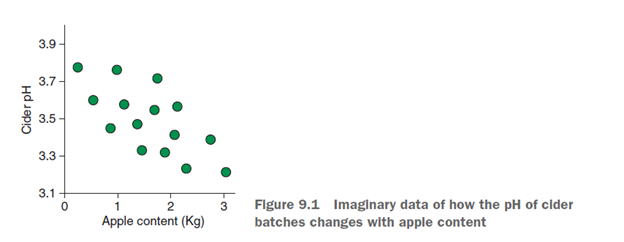
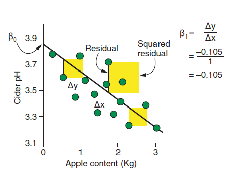
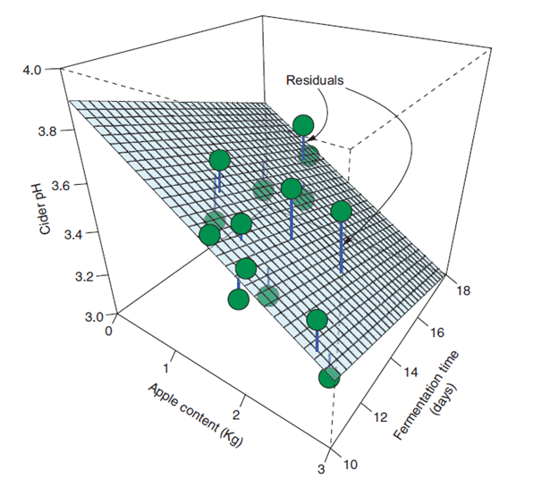
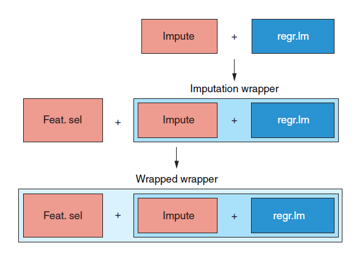

```{r setup, include=FALSE}
knitr::opts_chunk$set(echo = TRUE, warning=FALSE,comment = NA, message=FALSE,
                      fig.height=4, fig.width=6)
```

## Introduction
A classical and commonly used statistical method, linear regression builds predictive models by estimating the strength of the relationship between our predictor variables and our outcome variable. Linear regression is so named because it assumes the relationships between the predictor variables with the outcome variable are linear. Linear
regression can handle both continuous and categorical predictor variables, and I’ll show you how in this chapter.
By the end of this chapter, I hope you’ll understand a general approach to regression problems with mlr, and how this differs from classification. In particular, you’ll understand the different performance metrics we use for regression tasks, because mean misclassification error (MMCE) is no longer meaningful. I’ll also show you, as I promised in chapter 4, more sophisticated approaches to missing value imputation and feature selection. Finally, I’ll cover how to combine as many preprocessing steps as we like using sequential wrappers, so we can include them in our cross-validation.

### This chapter covers
* Working with linear regression
* Performance metrics for regression tasks
* Using machine learning algorithms to impute missing values
* Performing feature selection algorithmically
* Combining preprocessing wrappers in mlr

### What is linear regression?
In this section, you’ll learn what linear regression is and how it uses the equation of a straight line to make predictions. Imagine that you want to predict the pH of batches of cider, based on the amount of apple content in each batch (in kilograms). Consider the figure below
```{r}

```

### NOTE 
Recall from high school chemistry that the lower the pH, the more acidic a substance is. The relationship between apple weight and cider pH appears linear, and we could model this relationship using a straight line. Recall from chapter 1 that the only parameters needed to describe a straight line are the slope and intercept:
y = intercept + slopex + e
y is the outcome variable, x is the predictor variable, the intercept is the value of y when x is zero (where the line crosses the y-axis), and the slope is how much y changes when x increases by one unit.

### NOTE 
Interpreting the slope is useful because it tells us about how the outcome variable changes with the predictor(s), but interpreting the intercept is usually not so straightforward (or useful). For example, a model that predicts a spring’s tension from its length might have a positive intercept, suggesting that a spring of zero length has tension! If all the variables are centered to have a mean of zero, then the intercept can be interpreted as the value of y at
the mean of x (which is often more useful information). Centering your variables like this doesn’t affect the slopes because the relationships between variables remain the same. Therefore, predictions made by linear regression models are unaffected by centering and scaling your data.

If you were to read this out loud in plain English, you would say: “For any particular case, the value of the outcome variable, y, is the model intercept, plus the value of the predictor variable, x, times its slope.” Statisticians write this equation as

*y = β0 + β1x1 + ε*
where β0 is the intercept, β1 is the slope for variable x1, and ε is the unobserved error unaccounted for by the model.

##### NOTE
The parameters (also called coefficients) of a linear regression model are only estimates of the true values. This is because we are typically only working with a finite sample from the wider population. The only way to derive the true parameter values would be to measure the entire population, something that is usually impossible. 

So to learn a model that can predict pH from apple weight, we need a way to estimate the intercept and slope of a straight line that best represents this relationship. Linear regression isn’t technically an algorithm. Rather, it’s the approach to modeling relationships using the straight-line equation. We could use a few different algorithms to estimate the intercept and slope of a straight line. For simple situations like our cider pH problem, the most common algorithm is ordinary least squares (OLS). The job of OLS is to learn the combination of values for the intercept and slope that minimizes the residual sum of squares. In linear regression, we can visualize this as the vertical distance (along the y-axis) between a case and the straight line. But OLS doesn’t just consider the raw distances between each case and the line: it squares them first and then adds them all up (hence, sum of squares). This is illustrated for our cider example in figure

```{r}

```

Why does OLS square the distances? You may read that this is because it makes any negative residuals (for cases that lie below the line) positive, so they contribute to the sum of squares rather than subtract from it. This is certainly a handy by-product of squaring, but if that was true, we would simply use |residual| to denote the absolute value (removing the negative sign). We use the squared residuals so that we disproportionately penalize cases that are far away from their predicted value.

#### What if we have multiple predictors?
OLS finds the combination of slope and intercept that minimizes the sum of squares, and the line learned in this way will be the one that best fits the data. But regression problems are rarely as simplistic as trying to predict an outcome with a single predictor; what about when we have multiple predictor variables? Let’s add another variable to our cider pH problem:

When we have multiple predictors, a slope is estimated for each (using OLS), and the contributions of each variable are added together linearly, along with the model intercept (which is now the value of y when each predictor equals zero). The slopes in linear regression tell us how the outcome variable changes for a one-unit increase in each predictor while holding all other predictors constant. In other words, the slopes tell us how the outcome changes when we change the predictor variables, one at a time. For example, our two-predictor cider model would look like this:

$$
y = \beta_0 + \beta_1* Apples + \beta_2 * Fermentation + ε
$$

### NOTE 
You will sometimes see linear regression with a single predictor and regression with multiple predictors described as simple linear regression and multiple regression, respectively. I find this distinction a little unnecessary, however,because we rarely work with only a single predictor.

When we have two predictors, our line becomes a surface/plane. You can see this illustrated for our cider example in figure below. When we have more than two predictors, our plane becomes a hyperplane. Indeed, our straight-line equation can be generalized to any number of predictors

```{r}

```

Do you recognize the general linear model? You saw something similar to it when we covered logistic regression in chapter 4. In fact, everything on the right side of the equation is identical. The only difference is what was on the left side of the equals sign. Recall that in logistic regression, we predict the log odds of a case belonging to a particular class. In linear regression, we simply predict the case’s value of the outcome variable.

### When interpretability is as or more important than performance
While another regression algorithm may perform better for a particular task, models formulated using the general linear model are often favored for how interpretable they are. The slopes tell you how much the outcome variable changes with a one-unit increase of each predictor variable, holding all other variables constant. There are other algorithms that may learn models that perform better on a particular task but aren’t as interpretable. Such models are often described as being black boxes, where the model takes input and gives output, but it’s not easy to see and/or interpret the rules inside the model that led to that particular output. Random forest, XGBoost, and SVMs are examples of black-box models.

So when would we prefer an interpretable model (such as a linear regression model), over a black-box model that performs better? Well, one example is if our model has the potential to discriminate. Imagine if a model incorporated bias against women during training. It might be difficult to detect this immediately using a black-box model, whereas if we can interpret the rules, we can check for such biases. A similar consideration is safety, where it’s imperative to ensure that our model doesn’t give potentially dangerous outcomes (such as unnecessary medical intervention).

Another example is when we are using machine learning to better understand a system or nature. Getting predictions from a model might be useful, but understanding those rules to deepen our understanding and stimulate further research may be of more importance. Black boxes can make this difficult. Finally, understanding the rules of our model allows us to make changes in the way we do things. Imagine that a business uses a linear regression model to predict demand for a particular product, based on things like its cost and how much the company spends on advertising. Not only can the company predict future demand, but it also can control it, by interpreting the rules of how the predictor variables impact the outcome.

When modeling our data with the general linear model, we make the assumption that our residuals are normally distributed and homoscedastic. Homoscedastic is a ridiculous-sounding word (impress your friends with it) that simply means the variance of the outcome variable doesn’t increase as the predicted value of the outcome increases.

*TIP* The opposite of homoscedastic is heteroscedastic. 

We also make the assumption that there is a linear relationship between each predictor variable and the outcome, and that the effects of the predictor variables on the response variable are additive (rather than multiplicative). When these assumptions are valid, our model will make more accurate and unbiased predictions. However, the general linear model can be extended to handle situations in which the assumption of normally distributed residuals is violated (logistic regression is one such example).

*NOTE* I’ll show you how we can check the validity of these assumptions when
we build our own linear regression model later in the chapter.

In situations such as this, we turn to the generalized linear model. The generalized linear model is the same as the general linear model (in fact, the latter is a special case of the former), except that it uses various transformations called link functions to map the outcome variable to the linear predictions made by the right-hand side of the equals sign. For example, count data is rarely normally distributed, but by building a generalized model with an appropriate link function, we can transform linear predictions made by the model back into counts. I don’t intend to talk any further about generalized linear models here, but a good resource on this topic (if a little heavy) is Generalized Linear Models With Examples in R by Peter K. Dunn and Gordon K. Smyth (Springer, 2018).

*TIP* If the residuals are heteroscedastic, it sometimes helps to build a model that predicts some transformation of the outcome variable instead. For example, predicting the log10 of the response variable is a common choice. Predictions made by such a model can then be transformed back onto the original scale for interpretation. When the effect of multiple predictors on the outcome is not additive, we can add interaction terms to our model that state the effect of one predictor variable has on the outcome when the other predictor variable changes.

###vWhat if our predictors are categorical?
So far, we’ve only considered the situation where our predictors are continuous. Because the general linear model is essentially the equation of a straight line, and we use it to find the slopes between variables, how can we find the slope of a categorical variable? Does this even make sense? Well, it turns out we can cheat by recoding categorical variables into dummy variables. Dummy variables are new representations of categorical variables that map the categories to 0 and 1. Imagine that we want to predict the acidity of cider batches based on the type of apple: Gala or Braeburn. We want to find the intercept and slope that describes the relationship between these two apple types and acidity, but how do we do that? Remember earlier that the slope is how much y increases when x increases by one
unit. If we recode our apple type variable such that Gala = 0 and Braeburn = 1, we can treat apple type as a continuous variable and find how much acidity changes as we go from 0 to 1. Take a look at figure 9.5: the intercept is the value of y when x is 0, which is the mean acidity when apple type = Gala. Gala is therefore said to be our reference level. The slope is the change in y with a one-unit increase in x, which is the difference between the mean acidity for Gala and the mean acidity with Braeburn. This may feel like cheating, but it works, and the slope with the least squares will be the one that connects the means of the categories.

*NOTE* Which category you choose as the reference level makes no difference to the predictions made by a model and is the first level of the factor (the first alphabetically by default).

Recoding dichotomous (two-level) factors into a single dummy variable with values of 0 and 1 makes sense, but what if we have a polytomous factor (a factor with more than two levels)? Do we code them as 1, 2, 3, 4, and so on, and treat this as a single continuous predictor? Well, this wouldn’t work because it’s unlikely that a single straight line would connect the means of the categories. Instead, we create k – 1 dummy variables, where k is the number of levels of the factor. Take a look at the example in figure 9.6. We have four types of apples (Granny Smith is my favorite) and would like to predict pH based on the apple type used to make a particular batch of cider. To convert our four-level factor into dummy variables, we do the following:

*1 Create a table of three columns, where each column represents a dummy variable.*
*2 Choose a reference level (Gala, in this case).*
*3 Set the value of each dummy variable to 0 for the reference level.*
*4 Set the value of each dummy variable to 1 for a particular factor level.*

### Building your first linear regression model
In this section, I’ll teach you how to build, evaluate, and interpret a linear regression model to predict daily air pollution. I’ll also show other ways of imputing missing data and selecting relevant features, and how to bundle as many preprocessing steps into your cross-validation as you like. Imagine that you’re an environmental scientist interested in predicting daily levels of atmospheric ozone pollution in Los Angeles. Recall from high school chemistry that ozone is an allotrope (a fancy way of saying “another form”) of oxygen molecule that has three oxygen atoms instead of two (as in the dioxygen that you’re breathing right now). While ozone in the stratosphere protects us from the sun’s UV rays, products from burning fossil fuels can be converted into ozone at ground level, where it is toxic. Your job is to build a regression model that can predict ozone pollution levels based on the time of year and meteorological readings, such as humidity and temperature. Let’s start by loading the mlr and tidyverse packages:

````{r}
library(mlr)
library(tidyverse)
```

### Loading and exploring the Ozone dataset
Now let’s load the data, which is built into the mlbench package (I like the data examples in this package), convert it into a tibble (with as_tibble()), and explore it. We’re also going to give more readable names to the variables. We have a tibble containing 366 cases and 13 variables of daily meteorological and ozone readings.

```{r}
data(Ozone, package = "mlbench")
ozoneTib <- as_tibble(Ozone)
names(ozoneTib) <- c("Month", "Date", "Day", "Ozone", "Press_height",
                     "Wind", "Humid", "Temp_Sand", "Temp_Monte",
                     "Inv_height", "Press_grad", "Inv_temp", "Visib")
ozoneTib
```

At present, the Month, Day, and Date variables are factors. Arguably this may make sense, but we’re going to treat them as numerics for this exercise. To do this, we use the handy mutate_all() function, which takes the data as the first argument and a transformation/function as the second argument. Here, we use as.numeric to convert all the variables into the numeric class.

*NOTE* The mutate_all() function doesn’t alter the names of the variables, it
just transforms them in place.

Next, we have some missing data in this dataset (use map_dbl(ozoneTib, ~sum(is.na(.))) to see how many). Missing data is okay in our predictor variables (we’ll deal with this later using imputation), but missing data for the variable we’re trying to predict is not okay. Therefore, we remove the cases without any ozone measurement by piping the result of the mutate_all() call into the filter() function, where we remove cases with an NA value for Ozone.

```{r}
ozoneClean <- mutate_all(ozoneTib, as.numeric) %>%
  filter(is.na(Ozone) == FALSE)
ozoneClean
```

*NOTE* Could we have imputed missing data in our target variable? Yes we could, but this has the potential to introduce bias into our model. This is because we’ll be training a model to predict values that were themselves generated by a model.
Let’s plot each of our predictor variables against Ozone to get an idea of the relationships in the data. We start with our usual trick of gathering the variables with the gather() function so we can plot them on separate facets.

```{r, fig.height=6, fig.width=10}
ozoneUntidy <- gather(ozoneClean, key = "Variable",
                      value = "Value", -Ozone)
ggplot(ozoneUntidy, aes(Value, Ozone)) +
  facet_wrap(~ Variable, scale = "free_x") +
  geom_point() +
  geom_smooth() +
  geom_smooth(method = "lm", col = "red") +
  
  theme_bw()
```

*NOTE* Remember we have to use -Ozone to prevent the Ozone variable from being gathered with the others.

In our ggplot() call, we facet by Variable and allow the x-axes of the facets to vary by setting the scale argument equal to "free_x". Then, along with a geom_point layer, we add two geom_smooth layers. The first geom_smooth is given no arguments and so uses the default settings. By default, geom_smooth will draw a LOESS curve to the data (a curvy, local regression line) if there are fewer than 1,000 cases, or a GAM curve if there are 1,000 or more cases. Either will give us an idea of the shape of the relationships. The second geom_smooth layer specifically asks for the lm method (linear model), which draws a linear regression line that best fits the data. Drawing both of these will help us identify if there are relationships in the data that are nonlinear. The resulting plot is shown in figure 9.7. Hmm, some of the predictors have a linear relationship with ozone levels, some have a nonlinear relationship, and some seem to have no relationship at all!

### Imputing missing values
Linear regression can’t handle missing values. Therefore, to avoid having to throw away a large portion of our dataset, we’re going to use imputation to fill in the gaps. In chapter 4, we used mean imputation to replace missing values (NAs) with the mean of the variable. While this may work, it only uses the information within that single variable to predict missing values, and all missing values within a single variable will take the same value, potentially biasing the model. Instead, we can actually use machine learning algorithms to predict the value of a missing observation, using all of the other variables in the dataset! In this section, I’m going to show you how we can do this with mlr. If you run ?imputations, you’ll be able to see the imputation methods that come packaged with mlr. These include methods such as imputeMean(), imputeMedian(), and imputeMode() (for replacing missing values with the mean, median, and mode of each variable, respectively). But the most important method is the one last on the list:imputeLearner(). The imputeLearner() function lets us specify a supervised machine learning algorithm to predict what the missing values would have been, based on the information held in all the other variables. For example, if we want to impute missing values of a continuous variable, the process proceeds as follows: 
1 Split the dataset into cases with and without missing values for this particular variable. 
2 Decide on a regression algorithm to predict what the missing values would have been.
3 Considering only the cases without missing values, use the algorithm to predict the values of the variable with missing values, using the other variables in the dataset (including the dependent variable you’re trying to predict in your final model).
4 Considering only the cases with missing values, use the model learned in step 3 to predict the missing values based on the values of the other predictors. We employ the same strategy when imputing categorical variables, except that we choose a classification algorithm instead of a regression one. So we end up using a supervised learning algorithm to fill in the blanks so that we can use another algorithm to train our final model!

So how do we choose an imputation algorithm? There are a few practical considerations, but as always it depends somewhat and it may pay off to try different methods and see which one gives you the best performance. We can at least initially whittle it down to either a classification or regression algorithm, depending on whether the variable with missing values is continuous or categorical. Next, whether we have missing values in one or multiple variables makes a difference because if it’s the latter, we will need to choose an algorithm that can itself handle missing values. For example, let’s say we try to use logistic regression to impute missing values of a categorical variable.
We’ll get to step 3 in the previous procedure and stop because the other variables in the data (that the algorithm is trying to use to predict the categorical variable) also contain missing values. Logistic regression can’t handle that and will throw an error. If the only variable with missing values was the one we were trying to impute, this wouldn’t have been a problem. Finally, the only other consideration is computational budget. If the algorithm you’re using to learn your final model is already computationally expensive, using a computationally expensive algorithm to impute your missing values is added expense. Within these constraints, it’s often best to experiment with different imputation learners and see which one works best for the task at hand. When doing any form of missing-value imputation, it’s extremely important to ensure that the data is either missing at random (MAR) or missing completely at random (MCAR), and not missing not at random (MNAR). If data is MCAR, it means the likelihood of a missing value is not related to any variable in the dataset. If data is MAR, it means the likelihood of a missing value is related only to the value of the other variables in the dataset. For example, someone might be less likely to fill in their salary on a form because of their age. In either of these situations, we can still build models that are unbiased due to the presence of missing data. But consider the situation where someone is less likely to fill in their salary on a form because their salary is low. This is an example of data missing not at random (MNAR), where the likelihood of a missing value depends on the value of the variable itself. In such a situation, you would likely build a model that is biased to overestimate the salaries of the people in your survey.

How do we tell if our data is MCAR, MAR, or MNAR? Not easily. There are methods for distinguishing MCAR and MAR. For example, you could build a classification model that predicts whether a case has a missing value for a particular variable. If the model does better at predicting missing values than a random guess, then the data is MAR. If the model can’t do much better than a random guess, then the data is probably MCAR. Is there a way to tell whether data is MNAR? Unfortunately not. Being confident that your data is not MNAR depends on good experiment design and
thoughtful examination of your predictor variables. TIP There is a more powerful imputation technique called multiple imputation. The premise of multiple imputation is that you create many new datasets, replacing missing data with sensible values in each one. You then train a model on each of these imputed datasets and return the average model.
While this is probably the most widely used imputation technique, sadly, it isn’t implemented yet in mlr, so we won’t use it here. However, I strongly suggest you read the documentation for the mice package in R. For our ozone data, we have missing values across several variables, and they’re all continuous variables. Therefore, I’m going to choose a regression algorithm that can handle missing data: rpart. Yep, you heard me right: we’re going to impute the missing
values with the rpart decision tree algorithm. When we covered tree-based learners in chapter 7, we only considered them for classification problems; but decision trees can be used to predict continuous variables, too. I’ll show you how this works in detail in chapter 12; but for now, we’ll let rpart do its thing and impute our missing values for us.


```{r}
imputeMethod <- imputeLearner("regr.rpart")
ozoneImp <- impute(obj = as.data.frame(ozoneClean),
                   classes = list(numeric = imputeMethod))
```

We first use the imputeLearner() function to define what algorithm we’re going to use to impute the missing values. The only argument we supply to this function is the name of the learner, which in this case is "regr.rpart".

*TIP* There is an additional, optional argument, features, that lets us specify which variables in the dataset to use in the prediction of missing values. The default is to use all the other variables, but you can use this to specify variables without any missing values, allowing you to use algorithms that can’t themselves handle missing data. See ?imputeLearner for more detail.

Next, we use the impute() function to create the imputed dataset, to which the first argument is the data. We’ve wrapped our tibble inside the as.data.frame() function just to prevent repeated warnings about the data being a tibble and not a data frame (these can be safely ignored). We can specify different imputation techniques for different columns by supplying a named list to the cols argument. For example, we could say cols = list(var1 = imputeMean(), var2 = imputeLearner("regr.lm")). We can also specify different imputation techniques for different classes of variable (one technique for numeric variables, another for factors) using the classes argument in the
same way. In the following listing, we use the classes argument to impute all the variables (they are all numeric) using the imputeMethod we defined. This results in a dataset we can access using ozoneImp$data, whose missing values have been replaced with predictions from a model learned by the rpart algorithm. Now we can define our task and learner using the imputed dataset. By supplying "regr.lm" as an argument to the makeLearner() function, we’re telling mlr that we want to use linear regression.

```{r}
ozoneTask <- makeRegrTask(data = ozoneImp$data, target = "Ozone")
lin <- makeLearner("regr.lm")
lin
```

*NOTE* In part 2 of this book, we were used to defining learners as classif.[ALGORITHM]. In this part of the book, instead of classif., the prefix will be regr.. This is important because the same algorithm can sometimes be used for classification and regression, so the prefix tells mlr which task we want to use the algorithm for.

### Automating feature selection
Sometimes it may be obvious which variables have no predictive value and can be removed from the analysis. Domain knowledge is also very important here, where we include variables in the model that we, as experts, believe to have some predictive value for the outcome we’re studying. But it’s often better to take a less subjective approach to feature selection, and allow an algorithm to choose the relevant features for us. In this section, I’ll show you how we can implement this in mlr.

There are two methods for automating feature selection:
*Filter methods*
Filter methods compare each of the predictors against the outcome variable, and calculate a metric of how much the outcome varies with the predictor. This metric could be a correlation: for example, if both variables are continuous. The predictor variables are ranked in order of this metric (which, in theory, ranks them in order of how much information they can contribute to the model), and we can choose to drop a certain number or proportion of the worst-performing variables from our model. The number or proportion of variables we drop can be tuned as a hyperparameter during model building.

*Wrapper methods*
With wrapper methods, rather than using a single, out-of-model statistic to estimate feature importance, we iteratively train our model with different predictor variables. Eventually, the combination of predictors that gives
us the best performing model is chosen. There are different ways of doing this, but one such example is sequential forward selection. In sequential forward selection, we start with no predictors and then add predictors one by one. At each step of the algorithm, the feature that results in the best model performance is chosen. Finally, when the addition of any more predictors doesn’t result in an improvement in performance, feature addition stops, and the final model is trained on the selected predictors. 

Which method should we choose? It boils down to this: wrapper methods may result in models that perform better, because we are actually using the model we’re training to estimate predictor importance. However, because we’re training a fresh model at each iteration of the selection process (and each step may include other preprocessing steps such as imputation), wrapper methods tend to be computationally expensive. Filter methods, on the other hand, may or may not select the best-performing set of predictors but are much less computationally expensive.

## THE FILTER METHOD FOR FEATURE SELECTION
I’m going to show you both methods for our ozone example, starting with the filter method. There are a number of metrics we can use to estimate predictor importance. To see the list of the available filter methods built into mlr, run listFilterMethods(). There are too many to describe in full, but common choices include these:

* Linear correlation—When both predictor and outcome are continuous
* ANOVA—When the predictor is categorical and the outcome is continuous
* Chi-squared—When both the predictor and outcome are continuous
* Random forest importance—Can be used whether the predictors and outcomes are categorical or continuous (the default)

*TIP* Feel free to experiment with the methods implemented in mlr. Many of them require you to first install the FSelector package: install.packages ("FSelector"). 

The default method used by mlr (because it doesn’t depend on whether the variables are categorical or continuous) is to build a random forest to predict the outcome, and return the variables that contributed most to model predictions (using the out-of-bag error we discussed in chapter 8). In this example, because both the predictors and outcome variable are continuous, we’ll use linear correlation to estimate variable importance (it’s a little more interpretable than random forest importance).

First, we use the generateFilterValuesData() function (longest function name ever!) to generate an importance metric for each predictor. The first argument is the task, which contains our dataset and lets the function know that Ozone is our target variable. The second, optional argument is method, to which we can supply one of the methods listed by listFilterMethods(). In this example, I’ve used "linear.correlation". By extracting the $data component of this object, we get the table of predictors with their Pearson correlation coefficients.

```{r}
filterVals <- generateFilterValuesData(ozoneTask,
                                       method = "linear.correlation")
filterVals$data
```


```{r}
plotFilterValues(filterVals) +
  theme_bw()+
   theme(axis.text.x = element_text(angle = 90, vjust = 0.5))
```

It’s easier to interpret this information as a plot, which we can generate with the plot- FilterValues() function, giving the object we saved the filter values to as its argument. The resulting plot is shown in the figure above.

Now that we have a way of ranking our predictors in order of their estimated importance, we can decide how to “skim off” the least informative ones. We do this using the filterFeatures() function, which takes the task as the first argument, our filter- Vals object as the fval argument, and either the abs, per, or threshold argument. The abs argument allows us to specify the absolute number of best predictors to retain. The per argument allows us to specify a top percentage of best predictors to retain. The threshold argument allows us to specify a value of our filtering metric (in this case, correlation coefficient) that a predictor must exceed in order to be retained. We could manually filter our predictors using one of these three methods. This is shown in the following listing, but I’ve commented the lines out because we’re not going to do this. Instead, we can wrap together our learner (linear regression) and the filter method so that we can treat any of abs, per, and threshold as hyperparameters and tune them.

```{r}
ozoneFiltTask <- filterFeatures(ozoneTask,
                                fval = filterVals, abs = 6)
ozoneFiltTask <- filterFeatures(ozoneTask,
                                fval = filterVals, per = 0.25)
ozoneFiltTask <- filterFeatures(ozoneTask,
                                fval = filterVals, threshold = 0.2)
```

To wrap together our learner and filter method, we use the makeFilterWrapper() function, supplying the linear regression learner we defined as the learner argument and our filter metric as the fw.method argument.

```{r}
filterWrapper = makeFilterWrapper(learner = lin,
                                  fw.method = "linear.correlation")
```


*WARNING* Confusing terminology alert! We are still using the filter method for feature selection. It’s unfortunately confusing that we are making a filter wrapper, but this is not the wrapper method for feature selection. We will cover this shortly.

When we wrap together a learner and a preprocessing step, the hyperparameters for both become available for tuning as part of our wrapped learner. In this situation, it means we can tune the abs, per, or threshold hyperparameter using cross-validation, to select the best-performing features. In this example, we’re going to tune the absolute number of features to retain.

```{r}
lmParamSpace <- makeParamSet(
  makeIntegerParam("fw.abs", lower = 1, upper = 12)
)
gridSearch <- makeTuneControlGrid()
kFold <- makeResampleDesc("CV", iters = 10)
tunedFeats <- tuneParams(filterWrapper, task = ozoneTask, resampling = kFold,
                         par.set = lmParamSpace, control = gridSearch)
tunedFeats
```

*TIP* If you run getParamSet(filterWrapper), you’ll see that the hyperparameter names for abs, per, and threshold have become fw.abs, fw.per, and fw.threshold, now that we’ve wrapped the filter method. Another useful hyperparameter, fw.mandatory.feat, allows you to force certain variables to be included regardless of their scores.

First, we define the hyperparameter space, as usual, with makeParamSet(), and define fw.abs as an integer between 1 and 12 (the minimum and maximum number of features we’re going to retain). Next, we define our old friend, the grid search, using makeTuneControlGrid(). This will try every value of our hyperparameter. We define an ordinary 10-fold cross-validation strategy using makeResampleDesc() and then perform the tuning with tuneParams(). The first argument is our wrapped learner, and then we supply our task, cross-validation method, hyperparameter space, and search procedure. Our tuning procedure picks the 10 predictors with the highest correlation with ozone as the best-performing combination. But what’s mse.test.mean? You haven’t seen this performance metric before. Well, the performance metrics we used for classification, such as mean misclassification error, don’t make sense when we’re predicting continuous variables. For regression problems, there are three commonly used performance metrics:

*Mean absolute error (MAE)*—Finds the absolute residual between each case and the model, adds them all up, and divides by the number of cases. We can interpret this as the mean absolute distance of the cases from the model.

*Mean square error (MSE)*—Similar to MAE but squares the residuals before finding their mean. This means MSE is more sensitive to outliers than MAE, because the size of the squared residual grows quadratically, the further from the model prediction it is. MSE is the default performance metric for regression learners in mlr. The choice of MSE or MAE depends on how you want to treat outliers in your data: if you want your model to be able to predict such cases, use MSE; otherwise, if you want your model to be less sensitive to outliers, use MAE.

*Root mean square error (RMSE)*—Because MSE squares the residual, its value isn’t on the same scale as the outcome variable. Instead, if we take the square root of the MSE, we get the RMSE. When tuning hyperparameters and comparing models, MSE and RMSE will always select the same models (because RMSE is simply a transformation of MSE), but RMSE has the benefit of being on the same scale as our outcome variable and so is more interpretable.

*TIP* Other regression performance metrics are available to us, such as the percentage versions of MAE and MSE. If you’re interested in reading about more of the performance metrics available in mlr (and there are a lot of them), run ?measures.

Using the MSE performance metric, our tuned filter method has concluded that retaining the 10 features with the highest correlation with the ozone level results in the best-performing model. We can now train a final model that includes only these top 10 features in the task.

```{r}
filteredTask <- filterFeatures(ozoneTask, fval = filterVals,
                               abs = unlist(tunedFeats$x))
filteredModel <- train(lin, filteredTask)
```

First, we create a new task that includes only the filtered features, using the filter-Features() function. To this function, we supply the name of the existing task, the filterVals object we defined in listing 9.6, and the number of features to retain as the argument to abs. This value can be accessed as the $x component of tunedFeats and needs to be wrapped in unlist(); otherwise, the function will throw an error. This creates a new task that contains only the filtered predictors and retains Ozone as the target variable. Finally, we train the linear model using this task.

## THE WRAPPER METHOD FOR FEATURE SELECTION
With the filter method, we generate univariate statistics describing how each predictor relates to the outcome variable. This may result in selecting the most informative predictors, but it isn’t guaranteed to. Instead, we can use the actual model we’re trying to train to determine which features help it make the best predictions. This has the potential to select a better-performing combination of predictors, but it is computationally more expensive as we’re training a fresh model for every permutation of predictor variables. Let’s start by defining how we’re going to search for the best combination of predictors. We have four options:

*Exhaustive search*—This is basically a grid search. It will try every possible combination of predictor variables in your dataset and select the one that performs the best. This is guaranteed to find the best combination but can be prohibitively slow. For example, in our 12-predictor dataset, exhaustive search would need to try more than 1.3 × 109 different variable combinations!

*Random search*—This is just like random search in hyperparameter tuning. We define a number of iterations and randomly select feature combinations. The best combination after the final iteration wins. This is usually less intensive (depending on how many iterations you choose), but it isn’t guaranteed to find the best combination of features.

*Sequential search*—From a particular starting point, we either add or remove features at each step that improve performance. This can be one of the following:
– Forward search—We start with an empty model and sequentially add the feature that improves the model most until additional features no longer improve the performance.
– Backward search—We start with all the features and remove the feature whose removal improves the model the most until additional removals no longer improve the performance.
– Floating forward search—Starting from an empty model, we either add one variable or remove one variable at each step, whichever improves the model the most, until neither an addition nor a removal improves model performance.
– Floating backward search—The same as floating forward, except we start with a full model.

*Genetic algorithm*—This method, inspired by Darwinian evolution, finds pairs of feature combinations that act as “parents” to “offspring” variable combinations,which inherit the best-performing features. This method is very cool but can be computationally expensive as the feature space grows.

Wow! With so many options to choose from, where do we start? Well, I find the exhaustive and genetic searches prohibitively slow for a large feature space. While the random search can alleviate this problem, I find a sequential search to be a good compromise between computational cost and probability of finding the best-performing feature combination. Of its different variants, you may want to experiment with the various options to see which results in the best-performing model. I like the floating versions because they consider both addition and removal at each step, so for this example we’re going to use floating backward selection.

First, we define the search method using the makeFeatSelControlSequential() function (wow, the mlr authors really do love their long function names). We use "sfbs" as the method argument to use a sequential floating backward selection. Then, we use the selectFeatures() function to perform the feature selection. To this function we supply the learner, task, cross-validation strategy defined in listing 9.9, and search method. It’s as easy as that. When we run the function, every permutation of predictor variables is cross-validated using our kFold strategy to get an estimate of its performance. By printing the result of this process, we can see the algorithm selected six predictors that had a slightly lower MSE value than the predictors selected by our filter method

*TIP* To see all of the available wrapper methods and how to use them, run ?FeatSelControl.

Now I need to warn you about a frustrating bug with regard to the sequential floating forward search. As of this writing, using "sffs" as the feature-selection method will throw this error in some circumstances: Error in sum(x) : invalid 'type' (list) of argument. If you try to use "sffs" as the search method in this example, you may get such an error. Therefore, while this is very frustrating, I’ve opted to use sequential floating backward search ("sfbs") instead.

```{r}
featSelControl <- makeFeatSelControlSequential(method = "sfbs")
selFeats <- selectFeatures(learner = lin, task = ozoneTask,
                           resampling = kFold, control = featSelControl)
selFeats
```

Now, just as we did for the filter method, we can create a new task using the imputed data that contains only those selected predictors, and train a model on it.

```{r}
ozoneSelFeat <- ozoneImp$data[, c("Ozone", selFeats$x)]
ozoneSelFeatTask <- makeRegrTask(data = ozoneSelFeat, target = "Ozone")
wrapperModel <- train(lin, ozoneSelFeatTask)
```

## Including imputation and feature selection in cross-validation
I’ve said it many times before, but I’m going to say it again: include all data-dependent preprocessing steps in your cross-validation! But up to this point, we’ve only needed to consider a single preprocessing step. How do we combine more than one? Well, mlr makes this process extremely simple. When we wrap together a learner and a preprocessing step, we have essentially created a new learner algorithm that includes that preprocessing. So to include an additional preprocessing step, we simply wrap the wrapped learner! I’ve illustrated this for our example in figure 9.9. This results in asort of Matryoshka doll of wrappers, where one is encapsulated by another, which is encapsulated by another, and so on.

```{r}

```

Using this strategy, we can combine as many preprocessing steps as we like to create a pipeline. The innermost wrapper will always be used first, then the next innermost, and so on.

*NOTE* Because the innermost wrapper is used first, through to the outermost, it’s important to think carefully about the order you wish the preprocessing steps to take. Let’s reinforce this in your mind by actually doing it. We’re going to make an impute wrapper and then pass it as the learner to a feature-selection wrapper.

```{r}
imputeMethod <- imputeLearner("regr.rpart")
imputeWrapper <- makeImputeWrapper(lin,
                                   classes = list(numeric = imputeMethod))
featSelWrapper <- makeFeatSelWrapper(learner = imputeWrapper,
                                     resampling = kFold,
control = featSelControl)
```

First, we redefine our imputation method using the imputeLearner() function (first defined in listing 9.4). Then, we create an imputation wrapper using the makeImpute- Wrapper() function, which takes the learner as the first argument. We use list(numeric = imputeMethod) as the classes argument to apply this imputation strategy to all of our numeric predictors (all of them, duh). Now here comes the neat bit: we create a feature-selection wrapper using make-
FeatSelWrapper(), and supply the imputation wrapper we created as the learner. This is the crucial step because we’re creating a wrapper with another wrapper! We set the cross-validation method as kFold (defined in listing 9.9) and the method of searching feature combinations as featSelControl (defined in listing 9.11). Now, let’s cross-validate our entire model-building process like good data scientists.

```{r}
library(parallel)
library(parallelMap)
ozoneTaskWithNAs <- makeRegrTask(data = ozoneClean, target = "Ozone")
kFold3 <- makeResampleDesc("CV", iters = 3)
parallelStartSocket(cpus = detectCores())
lmCV <- resample(featSelWrapper, ozoneTaskWithNAs, resampling = kFold3)
parallelStop()
lmCV
```

After loading our friends the parallel and parallelMap packages, we define a task using the ozoneClean tibble, which still contains missing data. Next, we define an ordinary 3-fold cross-validation strategy for our cross-validation procedure. Finally, we start parallelization with parallelStartSocket() and start the cross-validation procedure by supplying the learner (the wrapped wrapper), task, and cross-validation strategy to the resample() function. This took nearly 90 seconds on my four-core machine, so I suggest you start the process and then read on for a summary of what the code is doing. The cross-validation process proceeds like this:
1 Split the data into three folds.
2 For each fold:
  a Use the rpart algorithm to impute the missing values.
  b Perform feature selection: Update template to support more than two levels of nested ordered lists.
  c Use a selection method (such as backward search) to select combinations of features to train models on.
  d Use 10-fold cross-validation to evaluate the performance of each model.
3 Return the best-performing model for each of the three outer folds.
4 Return the mean MSE to give us our estimate of performance. We can see that our model-building process gives us a mean MSE of 20.54, suggesting a mean residual error of 4.53 on the original ozone scale (taking the square root
of 20.54).

### Interpreting the model
Due to their simple structure, linear models are usually quite simple to interpret, because we can look at the slopes for each predictor to infer how much the outcome variable is affected by each. However, whether these interpretations are justified or not depends on whether some model assumptions have been met, so in this section I’ll show you how to interpret the model output and generate some diagnostic plots. First, we need to extract the model information from our model object using the getLearnerModel() function. By calling summary() on the model data, we get an output with lots of information about our model. Take a look at the following listing.

```{r}
wrapperModelData <- getLearnerModel(wrapperModel)
summary(wrapperModelData)
```

The Call component would normally tell us the formula we used to create the model (which variables, and whether we added more complex relationships between them). Because we built this model using mlr, we unfortunately don’t get that information here; but the model formula is all of the selected predictors combined linearly together. The Residuals component gives us some summary statistics about the model residuals. Here we’re looking to see if the median is approximately 0 and that the first and third quartiles are approximately the same. If they aren’t, this might suggest the residuals are either not normally distributed, or heteroscedastic. In both situations,
not only could this negatively impact model performance, but it could make our interpretation of the slopes incorrect.
The Coefficients component shows us a table of model parameters and their standard errors. The intercept is 41.8, which is the estimate of the ozone level when all other variables are 0. In this particular case it doesn’t really make sense for some of our variables to be 0 (month, for example) so we won’t draw too much interpretation from this. The estimates for the predictors are their slopes. For example, our model estimates that for a one-unit increase in the Temp_Sand variable, Ozone increases by 0.227 (holding all other variables constant). The Pr(>|t|) column contains the p values that, in theory, represent the probability of seeing a slope this large if the population slope was actually 0. Use the p values to guide your model-building process, by all means; but there are some problems associated with p values, so don’t put too much faith in them.

Finally, Residual standard error is the same as RMSE, Multiple R-squared is an estimate of the proportion of variance in the data accounted for by our model (68.9%), and F-statistic is the ratio of variance explained by our model to the variance not explained by the model. The p value here is an estimate of the probability that our model is better than just using the mean of Ozone to make predictions.

*NOTE* Notice the residual standard error value is close to but not the same as the RMSE estimated for the model-building process by cross-validation. This difference is because we cross-validated the model-building procedure, not this particular model itself.

We can very quickly and easily print diagnostic plots for linear models in R by supplying the model data as the argument to plot(). Ordinarily, this will prompt you to press Enter to cycle through the plots. I find this irritating and so prefer to split the plotting device into four parts using the mfrow argument to the par() function. This means when we create our diagnostic plots (there will be four of them), they will be tiled in the same plotting window. These plots may help us identify flaws in our model that impact predictive performance.

```{r}
par(mfrow = c(2, 2))
plot(wrapperModelData)
par(mfrow = c(1, 1))
```

The resulting plot is shown in the figure above. The Residuals vs. Fitted plot shows the predicted ozone level on the x-axis and the residual on the y-axis for each case. We hope that there are no patterns in this plot. In other words, the amount of error shouldn’t depend on the predicted value. In this situation, we have a curved relationship. This
indicates that we have nonlinear relationships between predictors and ozone, and/or heteroscedasticity. The Normal Q-Q (quantile-quantile) plot shows the quantiles of the model residuals plotted against their quantiles if they were drawn from a theoretical normal distribution.

If the data deviates considerably from a 1:1 diagonal line, this suggests the residuals are not normally distributed. This doesn’t seem to be a problem for this model: the residuals line up nicely on the diagonal. The Scale-Location plot helps us identify heteroscedasticity of the residuals. There should be no patterns here, but it looks like the residuals are increasingly varied with larger predicted values, suggesting heteroscedasticity.

Finally, the Residuals vs. Leverage plot helps us to identify cases that have excessive influence on the model parameters (potential outliers). Cases that fall inside a dotted region of the plot called Cook’s distance may be outliers whose inclusion or exclusion makes a large difference to the model. Because we can’t even see Cook’s distance here (it is beyond the axis limits), we have no worries about outliers.

These diagnostic plots (particularly the Residuals vs. Fitted plot) indicate the presence of nonlinear relationships between the predictor variables and the outcome variable. We may, therefore, be able to get better predictive performance from a model that doesn’t assume linearity. In the next chapter, I’ll show you how generalized additive
models work, and we’ll train one to improve our model performance. I suggest you save your .R file, because we’re going to continue using the same dataset and task in the next chapter. This is so I can highlight to you how much nonlinearity can impact the performance of linear regression.

## Strengths and weaknesses of linear regression
While it often isn’t easy to tell which algorithms will perform well for a given task, here are some strengths and weaknesses that will help you decide whether linear regression will perform well for you. The strengths of linear regression are as follows:

* It produces models that are very interpretable.
* It can handle both continuous and categorical predictors.
* It is very computationally inexpensive.

The weaknesses of linear regression are these:

* It makes strong assumptions about the data, such as homoscedasticity, linearity, and the distribution of residuals (performance may suffer if these are violated).
* It can only learn linear relationships in the data.
* It cannot handle missing data.


