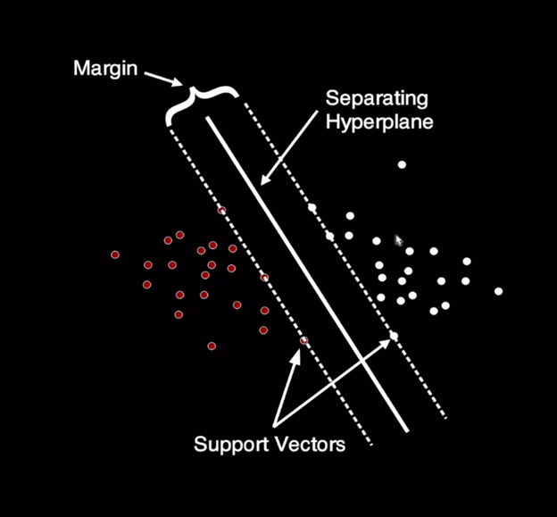

```{r setup, include=FALSE}
knitr::opts_chunk$set(echo = TRUE, comment = NA, message = FALSE, warning = FALSE,
                      fig.height = 5, fig.width = 7)
```

## Step 1: Installing the packages

The following packages are required sjmisc and sjPlot. To create the multinomial models the nnet package needs to be installed.

```{r}
library(recipes)
library(lava)
library(sjmisc)
library(igraph)
library(e1071)
library(hardhat)
library(ipred)
library(caret)
library(sjPlot)
library(nnet)
library(wakefield)
library(kknn)
library(dplyr)
library(nnet)
library(caTools)
library(ROCR)
library(stargazer)
library(dplyr)
library(nnet)
library(caTools)
library(ROCR)
library(stargazer)
library(ISLR)
library(ISLR2)
library(MASS)
library(splines)
library(splines2)
library(pROC)
library(ISLR)
library(ISLR2)
library(MASS)
library(splines)
library(splines2)
library(pROC)
library(randomForest)
library(rpart)
library(rpart.plot)
library(rattle)
library(ISLR2)
library(MASS)
library(splines)
library(pROC)
library(rattle)
library(rpart)
library(party)
library(partykit)
library(ggplot2)
library(tune)
library(TunePareto)
```

# SUPPORT VECTOR MACHINE
A Support Vector Machine (SVM) is a versatile and widely-used supervised machine learning algorithm designed for classification and regression tasks. SVM aims to find an optimal hyperplane or decision boundary that best separates data points into different classes or predicts continuous values, while maximizing the margin, which is the distance between the boundary and the nearest data points of each class. What sets SVM apart is its ability to handle high-dimensional data effectively and its flexibility to deal with non-linear relationships in the data through the kernel trick, which allows data to be implicitly mapped into higher-dimensional spaces. In binary classification, SVM seeks to find the hyperplane that best separates the two classes, and in multiclass scenarios, it uses strategies like one-versus-rest (OvR) or one-versus-one (OvO) to extend classification capabilities. SVM has found applications in diverse fields, including text classification, image recognition, and financial prediction, owing to its robustness and effectiveness in modeling complex decision boundaries.

SVM's key concepts include support vectors, which are data points that lie closest to the decision boundary and significantly influence the model, and the regularization parameter (C), which balances the trade-off between achieving a wide margin and minimizing misclassification errors. By maximizing the margin, SVM generally offers good generalization to new, unseen data. However, it can be computationally intensive for large datasets, and its interpretability is limited compared to simpler models like logistic regression. Despite these limitations, SVM remains a valuable tool in machine learning, particularly when dealing with high-dimensional data and complex classification problems, thanks to its ability to find optimal separating hyperplanes in various feature spaces.

Support Vector Machines (SVMs) have several key features and characteristics that make them a powerful and widely-used machine learning algorithm:

E*ffective for High-Dimensional Data:* SVMs are effective in scenarios where the number of features (dimensions) is greater than the number of samples. They excel in high-dimensional spaces, such as text classification or image recognition.

*Optimal Hyperplane:* SVM aims to find the optimal hyperplane that maximizes the margin, which is the distance between the decision boundary and the nearest data points of each class. This leads to better generalization to unseen data.

*Kernel Trick:* SVMs can handle non-linear data by implicitly mapping it into higher-dimensional spaces using kernel functions (e.g., polynomial, radial basis function). This allows SVMs to model complex decision boundaries.

*Sparsity:* SVMs are "sparse" models, meaning only a subset of data points, called support vectors, influence the decision boundary. This makes them memory-efficient and suitable for large datasets.

*Binary and Multiclass Classification:* SVMs can be used for both binary and multiclass classification tasks. Strategies like one-versus-rest (OvR) or one-versus-one (OvO) are employed for multiclass classification.

*Regularization Parameter (C):* The parameter C controls the trade-off between maximizing the margin and minimizing the classification error. Higher C values lead to a narrower margin but fewer misclassifications, while lower C values prioritize a wider margin but may tolerate some misclassifications.

*Robust to Outliers:* SVMs are less sensitive to outliers in the data compared to some other algorithms because the decision boundary is influenced by support vectors rather than all data points.

*Interpretability:* While not as interpretable as linear models like logistic regression, SVMs can provide insights into feature importance through the examination of support vectors and their associated coefficients.

*Versatile:* SVMs are versatile and can be applied to various machine learning tasks, including classification, regression (Support Vector Regression), and outlier detection.

*Well-Defined Theoretical Framework:* SVMs are founded on a well-defined mathematical framework with strong theoretical underpinnings, making them attractive for rigorous analysis.

*Popular in Real-World Applications:* SVMs have been successfully applied in a wide range of real-world applications, including image and text classification, bioinformatics, finance, and more.

*Scalability: *While SVMs can be computationally intensive for large datasets, methods like Stochastic Gradient Descent (SGD) and the use of approximate solvers have been developed to enhance scalability.

Overall, Support Vector Machines offer a powerful tool for both linear and non-linear classification problems, with a strong emphasis on maximizing the margin between classes, robustness, and adaptability to various data types and applications.

In this support vector machine, we are going to use "iris" data set
## View the data set
```{r}
data(iris)
data <- iris
head(data,5)
```

### View the structure of the dataset
```{r}
str(data)
attach(data)
```

The data set has 150 observations, 5 variables, 4 of which are numeric and one categorical variable, that is, species is a factor variable. Using these four numeric variables, we want to build a classification model will help us predict the correct species. We need to load some library including "ggplot2".

Let us make a plot of petal length and petal width
```{r}
library(ggplot2)
qplot(Petal.Length, Petal.Width, data = data)
```

Let us color the scatter plot and see if there is a possibility of separation.  

```{r}
qplot(Petal.Length, Petal.Width, 
      color = Species, data = data)
```

From the scatter plot above, thee is seperation based on the species as shown by different colors. The red one are "setosa", abd the green ones are" versicolor", and lastly the blue ones are "virginica". We can see that there is some seperation since the setosa species are far from the other two. 

Let us make a plot of sepal length and sepal width
```{r}
qplot(Sepal.Length, Sepal.Width, 
      color = Species, data = data)
```

## Support Vector Machine
Let us get a quick review of what is support vector machine. Consider the figure below
```{r}

```

The point points which are color coded are data points for two categories. These are two distinct classes. In other words, we are looking for optimal separating hyperplane between these two classes. We can only achieve that by maximizing the margin around the separating hyperplane. Points that lie on the boundary are called the support vectors. The middle line is the separating hyperplane. In situation where we cannot obtain a linear separator, data points are then projected into to a higher dimensional space so that the data points can be linearly separable. For this project we make use kernels. The program that help us achieve this is called the support vector machine. For this purpose of this demonstration, load the following library; "e1071", which is commonly used for support vector machine. We can now develope a support vector machine 

### Radial Kernel Function
```{r}
library(e1071)
model <- svm(Species~., data = data)
summary(model)
```

The output above gives the formula used. The type used is C-Classification with a "radial " SVM-Kernel. Since we are using Species as our dependent variable which is a factor variable, classification becomes the default type. Otherwise, if our dependent variable was a continuous, we would have a regression analysis in that case. But right now it is a classification. The cost implies that cost of constrained violation and the default is one, gamma is 0.25. The model has 51 support vectors. From the model, 8 support vectors belongs to the first species, 22 belongs to the second species and 21 belongs to the third species. We have three species are these are setosa, versicolor and virginica. Let us plot the results and see what comes out. But since we have four variables, we will to do some modification, otherwise, if we had only two variables (Petal length and Petal width), the code below would be sufficient. 

 

We will make use of slice for the other two quantitative variables. For the Sepal width we keep the constrain at 3 and sepat length constrained at 4.
```{r fig.width= 10, fig.height=6}
plot(model, data = data, 
     Petal.Width~Petal.Length,
     slice = list(Sepal.Width = 3, Sepal.Length = 4))
```

The above plot shows visualization of the support vector machine. The plot shows the data, support vectors represented by crosses and and the decision boundary. for the three types of species. The lower part of the graphs comprises data points belonging to the first species, the middle one comprises data points belonging to the second species and the upper part comprises data points belonging to the third species. The color represents the predicted class for each species. Like we said, we have 51 support vectors, 8, 22 and 21 belong to the first, second and third species, respectively.  

### Confusion Matrix and Misclassification Error
```{r}
library(caret)
library(lattice)
pred <- predict(model, data)
confusionMatrix(pred, data$Species)
```

From the results above, there are were 50 setosa species and the model also predicted that 50 species belongs to setosa. Additionally, the data has 48 versicolor species and the predicted them to belong to versicolor species. Lastly, there are were 48 virginica species and the model predicted the same. However, we also have mis-classification. From the data, we have 2 virginical species but the model predicted them to belong to versicolor species. Similarly, there are were 2 versicolor species but the model predicted that they belong to virginica. However, the model has an accuracy of approximately 97.33%. The mis-classification is approximately 2.67%. It is also good to note that this model used radial Kernel type. 

### Linear Kernel Function 
Other than radial function, we can use linear function as shown below. 
```{r}
model1 <- svm(Species~.,
             kernel = "linear",
             data = data)
summary(model1)
```

Now the kernel type is linear and not radial. The number of support vectors have reduced to 29 as compared to the previous 51. In this new model, 2 of the support vectors belong to the first species, 15 belongs to the second species and 12 support vectors belongs to the third species. Let us view the plot and see if there is any change.


```{r fig.width= 10, fig.height=6}
plot(model1, data = data, 
     Petal.Width~Petal.Length,
     slice = list(Sepal.Width = 3, Sepal.Length = 4))
```

Let us look at the confusion matrix
```{r}
pred1 <- predict(model1, data)
confusionMatrix(pred1, data$Species)
```

In the new model, we have slightly higher mis-classification of approximately 3.33% with the model accuracy of approximately 96.67%.  

### Polynomial Kernel Function
```{r}
model2 <- svm(Species~.,
             kernel = "polynomial",
             data = data)
summary(model2)
```

Using polynomial kernel function, the model has 54 support vectors where 6, 26 and 22 belonging to first, second and third category, respectively. Let us make the plot
```{r fig.width= 10, fig.height=6}
plot(model2, data = data, 
     Petal.Width~Petal.Length,
     slice = list(Sepal.Width = 3, Sepal.Length = 4))
```

### Confusion Matric and Misclassification Error
```{r}
pred2 <- predict(model2, data)
confusionMatrix(pred2, data$Species)
```

From the model above, the accuracy reduced to 95.33% as compared to the previous model with an increase in mis-classification of approximately 4.67%.  The model classify 7 species to belong in second category while in reality they belong in third category. 

### Sigmoid Kernel Function
```{r}
model3 <- svm(Species~.,
             kernel = "sigmoid",
             data = data)
summary(model3)
```

The results above represents the training of a Support Vector Machine (SVM) classifier using the sigmoid kernel for a multi-class classification problem. The formula "Species ~ ." suggests that the goal is to predict the "Species" variable using all the other variables in the dataset. This type of SVM is a C-classification, which means it is designed for multi-class classification tasks. The "cost" parameter is set to 1, indicating the trade-off between maximizing the margin and minimizing classification errors. The "coef.0" parameter is set to 0, which is the bias term.

The model has identified 54 support vectors. Support vectors are the data points closest to the decision boundary, and they play a crucial role in defining the decision boundary of the SVM. In this case, there are 6 support vectors for the "setosa" class, 26 support vectors for the "versicolor" class, and 22 support vectors for the "virginica" class.

There are three classes in this classification problem: "setosa," "versicolor," and "virginica." The model has learned to distinguish between these three classes based on the provided features. The sigmoid kernel is a non-linear kernel that can capture complex relationships between features and class labels. Overall, this SVM model with the sigmoid kernel has been trained to classify data into one of these three flower species based on the given dataset.

### Plot
```{r fig.width=10, fig.height=8}
plot(model3, data = data, 
     Petal.Width~Petal.Length,
     slice = list(Sepal.Width = 3, Sepal.Length = 4))
```

### Confusion Matrix
```{r}
pred3 <- predict(model3, data)
confusionMatrix(pred3, data$Species)
```

The confusion matrix and associated statistics provide a comprehensive evaluation of the performance of a classification model, presumably for a multiclass problem (with three classes: setosa, versicolor, and virginica). Here's what each part of the output means:

The confusion matrix displays the counts of true positive, true negative, false positive, and false negative predictions for each class. In this case, the three classes are setosa, versicolor, and virginica. For example, in the first row, it shows that 49 instances of setosa were correctly classified as setosa (true positives), and there were no false positives or false negatives for setosa. In the second row, it shows that 41 instances of versicolor were correctly classified as versicolor (true positives), 1 was incorrectly classified as setosa (false negative), and 7 were incorrectly classified as virginica (false positive). Overall Statistics:

Accuracy is the overall classification accuracy of the model, which is approximately 88.67%. It's the ratio of correctly predicted instances to the total instances. The 95% Confidence Interval (CI) provides a range for the accuracy estimate. The No Information Rate (NIR) represents the accuracy that would be achieved by simply predicting the majority class all the time (0.3333 in this case). The Kappa statistic measures the agreement between actual and predicted classifications, with a value of 0.83 indicating substantial agreement. This model has a lower accuracy as compared to the previous one, with a higher mis-classification error of approximately 11.33%. 

Sensitivity (also known as True Positive Rate or Recall) measures the proportion of true positives for each class. It tells you how well the model is at correctly identifying instances of each class. Specificity measures the proportion of true negatives for each class. It tells you how well the model is at correctly identifying instances not belonging to each class. Pos Pred Value (Positive Predictive Value or Precision) is the proportion of true positives among all predicted positives for each class. Neg Pred Value (Negative Predictive Value) is the proportion of true negatives among all predicted negatives for each class. Prevalence is the proportion of each class in the dataset. Detection Rate is the rate at which the model correctly detects each class. Detection Prevalence is the rate at which the model predicts each class. Balanced Accuracy is a measure that averages sensitivity and specificity and is particularly useful when dealing with imbalanced datasets.

In summary, this analysis provides a detailed breakdown of the model's performance for each class, including its ability to correctly classify instances, along with overall accuracy and additional statistics. It's essential to consider these metrics in the context of your specific problem and objectives to determine the model's effectiveness.

From all the support vector machine models above, signoid kernel function was the worst and radial kernel function was the best. Let us see if we can tune our model to get better classification. 

## Tuning/ Hyperparameter Optimization
This kind of optimzation helps to select the best model. 

```{r}
set.seed(123)
t.model <- tune(svm, Species~., data = data,
     ranges = list(epsilon = seq(0,1,0.1), cost=2^(2:9)))
```


The code above is the tune function to tune hyperparameters for a Support Vector Machine (SVM) classifier using the "Species" variable as the target variable and all other available features in the "data" dataset. Specifically, it seems to be tuning two hyperparameters: "epsilon" and "cost."

*tune:* This function is typically used for hyperparameter tuning in R. It takes various arguments to specify the model to be tuned, the data, and the hyperparameter search space.

*svm:* The svm function is the model that you are trying to tune. It's an SVM classifier for classification tasks.

*Species~.:* This formula specifies that you want to predict the "Species" variable based on all other variables in the dataset (denoted by the .).

*data = data:* This argument specifies the dataset from which the model should be trained and validated.

*ranges:* This argument specifies the hyperparameter search space. It appears to be defining a range for two hyperparameters:

*epsilon:* A range from 0 to 1 with a step of 0.1.
*cost:* A range of values obtained by raising 2 to the power of integers from 2 to 9.
The tune function will perform a grid search over the specified hyperparameter ranges, training and evaluating the SVM model with different combinations of "epsilon" and "cost." It will likely use some form of cross-validation to assess the model's performance for each combination of hyperparameters.

After running this code, you should get the best combination of hyperparameters that optimizes the model's performance on the dataset, as well as the corresponding model performance metrics for each combination. This is a common approach to find the best hyperparameters for machine learning models.

### Plot the Model
```{r fig.width=10, fig.height=8}
plot(t.model)
```

The graph give the performance of SVM of the two parameters, "cost" and "epsilon". Darker regions implies better results. From the graph if reduce the cost value we can as well get better results instead of going all the way to 2^9. 

```{r}
set.seed(123)
t.model1 <- tune(svm, Species~., data = iris,
     ranges = list(epsilon = seq(0,1,0.1), cost=2^(2:7)))
```


### Now make the plot
```{r fig.width=10, fig.height=8}
plot(t.model1)
```

The model seems to perform quite better. Let us now get the summary of this model
```{r}
summary(t.model1)
```

The sampling method is 10 fold cross validation with the best parameters as epsilon = 0 and cost = 8. Using these results we can choose our best model. 
```{r}
mymodel <- t.model1$best.model
summary(mymodel)
```

The output above represents the best-tuned Support Vector Machine (SVM) model for a classification task with three classes (setosa, versicolor, virginica). Here's an explanation of the key details:

*Model Type:*
The model type is C-classification, indicating that it's a classification model.

*SVM Kernel:*
The best-tuned SVM model uses the radial kernel. The radial kernel, also known as the Radial Basis Function (RBF) kernel, is a popular choice for SVMs as it can capture complex, non-linear decision boundaries effectively.

*Hyperparameters:*

The best-tuned hyperparameters are:
Cost: 8
Epsilon: The value of epsilon is not explicitly mentioned in this output, but it may have been chosen based on the tuning process.

*Number of Support Vectors:*
The model has 35 support vectors in total. 6 support vectors belong to the setosa class. 15 support vectors belong to the versicolor class. 14 support vectors belong to the virginica class.

*Number of Classes:*
There are three classes in this classification problem: setosa, versicolor, and virginica.
Levels:

This section lists the levels or class labels for the target variable, which are setosa, versicolor, and virginica. The best-tuned SVM model is selected based on the hyperparameters that maximize its performance on the training dataset, typically through techniques like cross-validation. In this case, the radial kernel and a cost value of 8 have been identified as the optimal hyperparameters. These hyperparameters are chosen to strike a balance between achieving a good fit to the training data and preventing overfitting. The number of support vectors indicates that the model is relying on a relatively small subset of the training data to define the decision boundary. This can be beneficial for generalization and model simplicity.

Overall, this best-tuned SVM model is designed to classify new data points into one of the three classes (setosa, versicolor, or virginica) using the radial kernel and the specified cost parameter, which have been determined as the optimal choices through the tuning process.

### Plot the Best Model
```{r fig.width=10, fig.height=8}
plot(mymodel, data = iris, 
     Petal.Width~Petal.Length,
     slice = list(Sepal.Width = 3, Sepal.Length = 4))
```

### Confusion Matrix and Misclassification Error
```{r}
pred4 <- predict(mymodel, iris)
confusionMatrix(pred4, iris$Species)
```

The confusion matrix provided illustrates the performance of a support vector machine (SVM) model in classifying iris species into three categories: setosa, versicolor, and virginica. Each cell in the matrix represents the number of instances where the predicted class matches the true class. In this case, the SVM model achieved high accuracy, with only a few misclassifications. For instance, all 50 instances of setosa were correctly classified, as were 48 out of 50 instances of versicolor and all 50 instances of virginica. This indicates that the model generally performs well across all classes.

Furthermore, the overall statistics provide additional insights into the model's performance. The accuracy of 0.9867 indicates that the model correctly classified approximately 98.67% of the instances in the dataset. Additionally, the 95% confidence interval (CI) suggests that the true accuracy of the model lies within the range of 95.27% to 99.84%. These results indicate a high level of confidence in the model's accuracy. The kappa statistic, which measures the agreement between the predicted and actual classes while accounting for the possibility of agreement by chance, is 0.98, indicating almost perfect agreement between the model's predictions and the true classes.

Examining the statistics by class provides a more detailed understanding of the model's performance for each iris species. Sensitivity, also known as the true positive rate, measures the proportion of actual positives that are correctly identified by the model. In this case, the model achieved a sensitivity of 1.0000 for setosa and virginica, indicating that it correctly identified all instances of these species. For versicolor, the sensitivity is slightly lower at 0.9600, indicating that a small proportion of versicolor instances were misclassified as another species. Specificity, on the other hand, measures the proportion of actual negatives that are correctly identified by the model. The model achieved high specificity for all classes, with values close to 1.0000, indicating that it rarely misclassifies instances from other classes as belonging to a specific class.

Moreover, the positive predictive value (PPV) measures the proportion of instances predicted as positive that are correctly classified. The PPV values are high for all classes, indicating that when the model predicts a particular species, it is highly likely to be correct. The negative predictive value (NPV), which measures the proportion of instances predicted as negative that are correctly classified, is also high for all classes. Prevalence refers to the proportion of instances belonging to a specific class in the dataset. Detection rate and detection prevalence provide additional insights into the model's performance, indicating the rate at which the model correctly detects instances of each class and the proportion of instances in the dataset that are correctly classified, respectively. Lastly, balanced accuracy considers the sensitivity and specificity of the model across all classes and provides a single metric to evaluate overall model performance. In this case, the balanced accuracy values are high for all classes, further indicating the robustness of the SVM model in classifying iris species. Overall, the results suggest that the SVM model is highly effective in distinguishing between different iris species and performs well across all classes.


